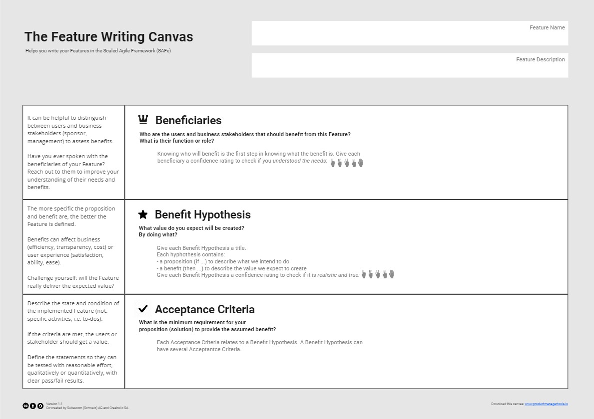
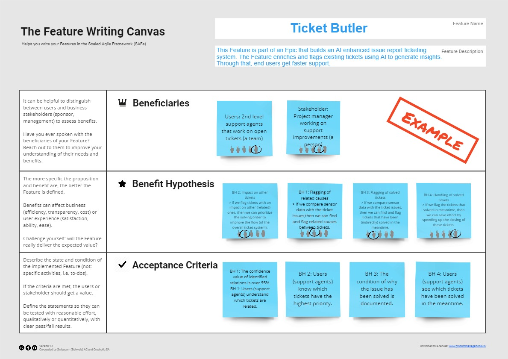

Crafting high-quality features requires precision and clarity. The Feature Writing Canvas provides a structured approach, including identifying beneficiaries, creating a benefit hypothesis, and setting acceptance criteria. This ensures that features fulfill their purpose and deliver value to both the business and end users. Emphasizing user engagement and hypothesis validation, this approach streamlines prioritization, implementation, and testing for product success.

<!--truncate-->

## Elevate the value of your features

According to the [Scaled Agile Framework (SAFe)](https://www.scaledagileframework.com/features-and-capabilities/), a feature is defined as "a service that fulfills a stakeholder's need." Integral to this definition are a benefit hypothesis and acceptance criteria, both tailored for delivery by a single Agile Release Train within a Program Increment. However, merely defining a feature isn't enough. How it is described is equally crucial.

The software industry embraces the principle: "[garbage in, garbage out](https://en.wikipedia.org/wiki/Garbage_in,_garbage_out)." This underscores the idea that the input's quality, in this case, the feature description, profoundly affects the output or end result. A loosely defined feature could jeopardize its value, affecting both internal stakeholders and end users. Recognizing this need for precision, companies like [Creaholic](https://creaholic.com/) have partnered with [Swisscom](https://www.swisscom.ch/) to enhance feature definitions and thereby boost end-user value.

## Crafting features with precision

Navigating the intricate landscape of feature development requires more than a basic understanding of what a feature should do. This section delves into the [Feature Writing Canvas](https://productmanagertools.io/feature-writing-canvas.html) and the  structured approach to crafting high-quality features. From identifying the specific beneficiaries to laying down an insightful benefit hypothesis and setting measurable acceptance criteria, this canvas acts as a roadmap for product managers and development teams. The aim is to ensure that every feature fulfills its intended purpose and delivers measurable value to both the business and the end users. Through a blend of examples and best practices, this section guides you to translate abstract ideas into features that resonate with precision and impact.

### 1. Beneficiaries: Centering the user

The foundation of a high-quality feature is understanding its intended users or stakeholders. Who are they? What are their needs? Especially in expansive IT projects, engaging directly with end users is pivotal. This direct communication not only captures their requirements but also enriches your understanding.

**Good Example**: "Our feature is designed for both administrators and regular users."  

**Bad Example**: "Some people might like our feature."

### 2. Benefit Hypothesis: Pinpointing the Advantage

The canvas's second segment emphasizes the benefit hypothesis, which follows this structure: 

> If (proposition), then (benefit)

While the proposition lays out the feature's purpose, the benefit elucidates its anticipated impact. These benefits could span across various areas: from heightened efficiency and cost-cutting to boosting user satisfaction. It's imperative for product managers to scrutinize and validate these hypotheses perpetually.

**Good Example**: "If we introduce a one-click checkout feature, then we anticipate enhanced user satisfaction and a surge in sales."  

**Bad Example**: "Changing a few things might be good."

### 3. Acceptance criteria: Setting the gold standard

Acceptance criteria function as the yardstick against which a feature's success is measured. As per the SAFe, they "alleviate implementation risks and provide an avenue for the early validation of the benefit hypothesis." They should not be misconstrued as mere to-do lists or blueprints but as vivid depictions of the system once the feature has been integrated.

**Good Example**: "The one-click checkout should diminish the average checkout duration by a minimum of 30%."  

**Bad Example**: "It should work faster."

## Navigating towards feature excellence

Embracing a uniform writing format is pivotal for elevating feature quality. This approach mirrors the paradigm shift in story-writing where certain formats are now revered as the gold standard. The ultimate secret, however, lies in galvanizing product managers to deeply connect with their users. This transition from traditional to agile methodologies places paramount importance on user engagement and hypothesis validation.

Given that feature implementation demands significant resources, understanding its core proposition and potential benefits becomes indispensable. This clarity aids in streamlining prioritization, implementation, and testing, ultimately laying the foundation for product success.

## Elevate your feature development

Ready to redefine your feature development strategy? Download the [Feature Writing Canvas](https://productmanagertools.io/feature-writing-canvas.html) PDF from the Product Manager Tools website. Step into the world of precise feature crafting that truly resonates with your users.

## References

- [Scaled Agile Framework (SAFe) - Features and Capabilities](https://www.scaledagileframework.com/features-and-capabilities/)
- [Garbage In, Garbage Out - Wikipedia](https://en.wikipedia.org/wiki/Garbage_in,_garbage_out)
- [Creaholic](https://creaholic.com/)
- [Swisscom](https://www.swisscom.ch/)

