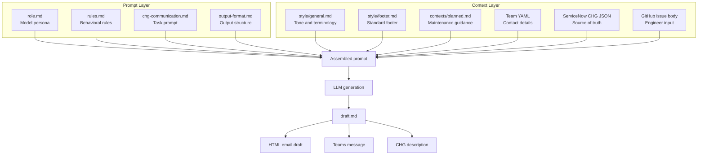

:::note[About this sample]
Prompt architecture and content standards for a GitHub Actions-based platform that generates a complete planned maintenance communication package directly from a ServiceNow CHG ticket, triggered by a single GitHub issue.

**Role:** Prompt architecture, context engineering, content standards, documentation.

**Organization:** Enterprise DevOps — Cigna.

**Platform:** GitHub Actions, ServiceNow, Copilot CLI (Claude Sonnet).

**Status:** Beta launch April 2026.
:::

## The problem

Every planned maintenance communication at Cigna's Enterprise DevOps organization was written from scratch. Each engineer drafted their own version — different tone, different structure, different level of detail. Recipients got a different experience with every send. Engineers manually copied content from ServiceNow change records, creating version drift between the ticket and the email. Engineers spent time wordsmithing maintenance notifications instead of focusing on the change itself.

## What I built

I designed and owned the content layer of the DevOps Communications Utility — a GitHub Actions-based platform that generates a complete planned maintenance communication package directly from a ServiceNow CHG ticket, triggered by a single GitHub issue.

**One issue produces three outputs:**

- A structured HTML email draft with all required sections pre-filled
- A condensed Markdown Teams message formatted for the EDO Announcements channel
- A plain-language CHG description ready to paste into ServiceNow

I built the platform alongside automation engineer Joaquin Quintana, who owned the GitHub Actions workflow, ServiceNow API integration, LLM parser, and PR creation scripts. My ownership was the content and prompt layer — the architecture that determines what the model writes, how it writes it, and what it can and cannot do.

## Prompt and context engineering

The most technically differentiated part of my contribution was the prompt architecture. Rather than giving the model a single instruction, I designed a five-layer system that separates what the model *is* from what it *knows* from what it *must do*.

### The prompt layer — assembled in order at runtime

1. **`role.md`** — Defines the model's persona: a communications specialist writing for a mixed audience of engineers and business stakeholders at a Flesch-Kincaid grade level of 8–10.
2. **`rules.md`** — Enforces 15+ explicit behavioral rules that override the model's defaults: active voice in "What's happening," present tense, never use "may" (use "might"), never use a bullet list for a single item, no cross-section redundancy, hardcoded planning and contact bullets in every "Action required" section.
3. **`chg-communication.md`** — The task prompt: four outputs to produce, section-by-section writing instructions, and field mappings from ServiceNow data to HTML template placeholders.
4. **`output-format.md`** — Instructs the model to write to `draft.md` using its write tool, with four exact section markers the downstream parser depends on.

### The context layer — injected via `{{PLACEHOLDER}}` tokens

| Context input | Purpose |
|---|---|
| `style/general.md` | Tone, voice, formatting rules, words-to-avoid table, and approved terminology. The model follows all guidelines in this file. |
| `style/footer.md` | Standard footer block injected separately so the model does not generate it. |
| `contexts/planned.md` | Tone and structural guidance specific to planned maintenance: what the communication is for, what to avoid, and how the Teams message differs from the email. |
| Team YAML | Contact name, email, Teams channel, department, and managed applications. |
| ServiceNow record | The pruned CHG ticket JSON — the source of truth for all content. |
| Issue body | The engineer's GitHub issue submission, which requires only the CHG number and optionally includes additional recipient actions. |

I added each rule in `rules.md` in response to a specific failure observed in real output — passive voice constructions, redundant facts across sections, "version 3.19.4" instead of "v3.19.4". The rules file is the institutional memory of what the model gets wrong without guidance.

## Content standards

I authored the full content standards injected into every generation:

- **Style guide** — Covers tone and voice principles, date/time formatting, sentence case in headings, title case in titles, approved terminology, and a words-to-avoid table (including "should," "may," "please," "and/or," "leveraging," and others).
- **Ensure vs. confirm** — Enforced in both the style guide and rules file.
- **Should vs. must** — "Should" implies optional; the rules file prohibits it for required actions.
- **Version number formatting** — Always lowercase `v` prefix; "version 3.19.4" and "Version 3.19.4" are explicitly prohibited.
- **HTML email template** — Uses `{{PLACEHOLDER}}` tokens mapping to the JSON output of every generation.

## Documentation suite

Beyond the platform itself, I produced the complete documentation suite.

| Deliverable | Audience | Description |
|---|---|---|
| Architecture reference | Engineers, architects | End-to-end workflow overview, Mermaid flowchart, two-stage design rationale, pipeline deep dive covering every script in execution order, and configuration reference. |
| User guide | Engineers | Consolidated end-to-end guide: how to fill in a ServiceNow CHG record, submit the GitHub issue, review the PR, and send. |
| CHG description authoring guide | Engineers | Explains how CHG field entries map to generated output, with before/after examples showing prose and bullet list inputs. |
| Troubleshooting guide | Engineers | Organized by CHG field issues, communication issues, and workflow issues. |
| <a href={vars.devOpsCommsUtility} target="_blank" rel="noopener noreferrer">Stakeholder one-pager (Word)</a> | Leadership, stakeholders | Three presentations: platform overview, prompt and context engineering for a technical audience, and automation and infrastructure covering the nine-step pipeline and configuration reference. |

## What this demonstrates

This project sits at the intersection of three things I do: prompt engineering, content standards, and documentation. The work isn't just writing about a platform — it's designing the system that makes the platform write well. The style guide isn't a document engineers read; it's a file the AI model reads. The rules aren't editorial guidelines; they're behavioral constraints enforced at generation time.

Along with TechWrit AI, it's one of two systems I've built where documentation standards are enforced during generation, not after.

*Built alongside Joaquin Quintana (automation, Python, GitHub Actions) at Cigna Enterprise DevOps.*