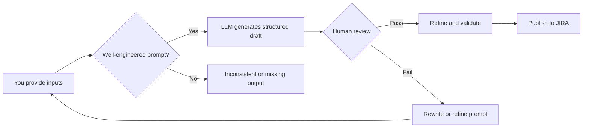

:::note[About this sample]
Use this pattern to turn messy technical inputs into structured, developer-ready outputs — without sacrificing correctness. The same pattern transfers to API docs, SDK guides, integration tutorials, and workshop materials.

**Role:** Prompt engineering, validation framework design, documentation.

**Organization:** Enterprise DevOps — Cigna.

**Platform:** LLM prompt templates with schema-driven output.

**Status:** Published June 2025.
:::

:::caution[Guardrail principle: AI drafts; humans verify]
<Tooltip content="Large Language Model">LLM</Tooltip>s can produce fluent output that is subtly wrong. This page emphasizes human-in-the-loop review, testable acceptance criteria, and explicit validation to protect accuracy and developer trust.
:::

## Before you begin

Confirm you have access to a generative AI (GenAI) tool and a basic understanding of the JIRA feature you want to document. You do not need to know the full technical details — the prompts are designed to help you structure what you know.

## Why use structured templates?

- **Structure reduces ambiguity** — templates prevent missing critical sections.
- **LLMs can be confidently wrong** — guardrails help you catch subtle errors.
- **Validation is non-negotiable** — accuracy builds developer trust.
- **Clear inputs produce better outputs** — you define the problem, constraints, and success criteria.

## When LLMs help vs. when they create problems

<Tabs defaultValue="helpful" queryString="llm-use">
  <TabItem value="helpful" label="When to use LLMs">

    Use an LLM when you:

    - Understand the JIRA template structure and requirements.
    - Use well-engineered prompts with specific instructions.
    - Need to convert rough technical notes into user-friendly language.
    - Want to ensure no critical sections are overlooked.
    - Require consistency across multiple features.

  </TabItem>
  <TabItem value="risk" label="When LLMs create problems">

    LLMs create problems when you:

    - Don't understand what each template section requires.
    - Copy output without reviewing for accuracy and completeness.
    - Assume the LLM understands your specific context and constraints.
    - Skip validation because "AI wrote it."
    - Use it as a replacement instead of an assistant.

  </TabItem>
</Tabs>

---

## How this toolkit works

The prompts in this toolkit direct AI responses by providing:

- **Schema-driven output** — structured sections that keep drafts consistent.
- **Constraints and anti-patterns** — explicit instructions for what to avoid.
- **Human-in-the-loop checks** — accuracy, testability, and completeness.
- **Refinement prompts** — targeted improvements without restarting.

## Workflow: draft, refine, validate



1. Choose the right prompt from the [Prompt library](#prompt-library) based on your situation.
2. Use any GenAI tool you prefer.
3. Enter your specific details in the prompt template.
4. Submit and review the output carefully — you are the subject matter expert.
5. Refine using [Quick refinement prompts](#quick-refinement-prompts) to address gaps or issues.
6. Validate completeness using the [Validation checklist](#validation-checklist).
7. Publish the validated output in the appropriate format: spec, doc page, PRD, tutorial, or API guide.

## Your responsibility: accuracy and review

GenAI is your writing assistant, not your replacement. You remain the subject matter expert responsible for:

- **Technical accuracy** — Does the solution actually work this way?
- **User benefit validation** — Are these benefits real and achievable?
- **Testable criteria** — Can QA actually test these acceptance criteria?
- **Problem authenticity** — Does this problem statement reflect real user pain?
- **Risk assessment** — Are these the right risks to address?

Review every output before moving to the refinement or validation step.

## Prompt library

### Comprehensive prompt

**When to use:** Creating complete JIRA features with structured inputs.

**Best for:** New features, major updates, or when you have detailed information.

```text title="Comprehensive prompt"
Use clear, non-technical language focused on user value to generate a JIRA feature description based on these inputs:

Contact person: [name]
Feature name: [what you're building]
Technical purpose: [what it does technically]
Target users: [who will use it]
Problem it solves: [current pain point]
Business goal/OKR: [what objective it supports]

=== STRUCTURED OUTPUT TEMPLATE ===
Format the output as:
**Primary point of contact:** [Name]

#### What is it
• [User-friendly explanation of what users can do]
• [Focus on user capabilities and goals]
• [Clear description of the experience]

#### Problem statement
• [Specific user frustration with example]
• [Scenario where users currently struggle]
• [Why existing solutions fall short]

#### Validation
• [Data point: "Users report..."]
• [User feedback: "Users have requested..."]
• [Business goal: "Supports our objective to..."]

### User intent
As a **[User Role]**,
I want **[to perform specific action]**,
So that **[I can achieve specific outcome]**.

### User benefits
[2-3 sentences describing how this makes the user's life better, saves time, or enables new capabilities]

### Risks
[1-2 key implementation or adoption risks with mitigation strategies]

### Acceptance criteria
• Given a user is [context], when they [action], then [expected result]
• Given [setup condition], when [user action], then [system response]
• Given [error condition], when [user action], then [appropriate error handling]
• The system should [specific measurable behavior]
• Users should be able to [specific capability with success metric]
```

### Simple input form

**When to use:** Brainstorming, early ideas, or a conversational approach.

**Best for:** Converting rough concepts into structured features.

```text title="Simple input form prompt"
Fill this out and the tool generates your JIRA feature using the structured output template:

=== QUICK INPUTS ===
Contact:
What I'm building:
Who uses it:
Problem it fixes:
How we know it's needed:
Related business goal:
Main risk:

=== TEST SCENARIOS (describe what should happen) ===
Scenario 1:
Scenario 2:
Scenario 3:
Error case:

=== STRUCTURED OUTPUT TEMPLATE ===
Copy the Structured Output Template from the Comprehensive prompt section and paste it here.
```

### One-line feature generator

**When to use:** Sprint planning, rapid documentation, or well-understood features.

**Best for:** Quick turnaround when you have a clear, simple feature.

```text title="One-line feature generator prompt"
Generate a complete JIRA feature for: "[feature name] that helps [user type] to [do something] by [how it works] because [problem it solves]. Contact: [name]"

Include both description and acceptance criteria sections using the following structured template.

=== STRUCTURED OUTPUT TEMPLATE ===
Copy the Structured Output Template from the Comprehensive prompt section and paste it here.
```

### Convert engineer notes

**When to use:** You have rough technical notes that need organization.

**Best for:** Transforming existing documentation into structured features.

```text title="Convert engineer notes prompt"
Convert these engineering notes into a proper JIRA feature:

[paste technical notes]

Structure it with all required sections and user-focused language. Translate technical concepts into user benefits and actionable acceptance criteria.

=== STRUCTURED OUTPUT TEMPLATE ===
Copy the Structured Output Template from the Comprehensive prompt section and paste it here.
```

### LLM and vector database integrations

**When to use:** Documenting Retrieval-Augmented Generation (RAG) workflows, embeddings pipelines, retrieval configuration, and safety constraints.

**Best for:** Producing developer-ready integration documentation with clear steps, assumptions, and validation.

```text title="LLM + vector database integration prompt"
You are writing a developer guide for integrating an LLM with a vector database.

Inputs:
- Use case: [semantic search / RAG / classification / moderation]
- Model: [model name + constraints]
- Vector DB: [system + index type]
- Embeddings: [model + dimension]
- Data flow: [ingest -> embed -> store -> retrieve -> generate]
- Security/safety constraints: [PII handling, rate limits, abuse considerations]
- Success criteria: [latency, relevance, accuracy]

Output format:
1) Overview (what this enables, who it's for)
2) Architecture diagram description (components + responsibilities)
3) Step-by-step implementation (with code placeholders)
4) Configuration options (what to tune and why)
5) Validation & troubleshooting (how to verify it works)
6) Safety & misuse considerations (what to watch for)
7) Acceptance criteria / success metrics (measurable)

Rules:
- Do not invent APIs. If an endpoint or method isn't provided, insert a TODO marker.
- Use clear language and define terms briefly.
- Include explicit assumptions and prerequisites.
```

:::caution[You are responsible for]
- Ensure technical correctness and constraints.
- Ensure examples and criteria are testable.
- Remove speculation and unsupported claims.
- Confirm the output matches the intended audience (developers vs. partners).
:::

### Context-specific prompts

Use these when the standard prompts don't fully fit your feature type. Each is tuned to avoid the most common pitfalls for that context.

#### Backend features

**Purpose:** Highlight user benefits from performance improvements without technical jargon.

**Avoids:** Jargon walls and missing information about user impact.

```text title="Backend feature prompt"
I'm building a backend feature:
- Technical: [what it does]
- User impact: [what changes for users]
- Performance gain: [metrics]
- Developer: [name]

Generate a user-focused JIRA description that explains the value without mentioning the technical implementation. Focus on how users experience the improvement.
```

#### UI features

**Purpose:** Emphasize visual changes and user interactions.

**Avoids:** Kitchen-sink features by focusing on specific workflows.

```text title="UI feature prompt"
I'm adding a UI feature:
- New element: [what I'm adding]
- Location: [where it appears]
- User action: [what users can do]
- Solves: [what problem]
- Developer: [name]

Generate a JIRA feature focusing on the user workflow improvement and visual experience.
```

#### Integration features

**Purpose:** Explain how external services benefit users without technical details.

**Avoids:** Missing context about why the integration matters.

```text title="Integration feature prompt"
I'm integrating with [service]:
- Enables users to: [capability]
- Replaces: [current manual process]
- Saves: [time/effort metric]
- Developer: [name]

Generate a JIRA feature that explains the user value without technical integration details.
```

## Quick refinement prompts

Use these to improve an existing draft without starting from scratch. Run them after your initial review identifies gaps.

### Make it less technical

```text title="Make it less technical"
Rewrite this JIRA description to be more user-friendly.

Replace technical terms with plain language focused on user outcomes. Focus on what users can do and why they care.

[paste existing content to refine]
```

### Add missing sections

```text title="Add missing sections"
This JIRA feature is missing [validation/risks/acceptance criteria].

Generate the missing sections based on the existing content and our template requirements.

[paste existing content]
```

### Strengthen user benefits

```text title="Strengthen user benefits"
Rewrite the user benefits section to be more specific and measurable. Focus on concrete improvements to the user experience.

Current benefits: [paste current benefits]
Context: [brief description of the feature]
```

## Validation checklist

Run this check every time before submitting a JIRA feature. Paste your completed draft into any GenAI tool with the prompt below.

```text title="Validation checklist prompt"
Check if this JIRA feature meets our quality standards:

[paste feature output]

Confirm it has:
- [ ] Contact person named
- [ ] 2-3 "What is it" points (user-focused, no technical jargon)
- [ ] 2-3 "Problem statement" points (with specific examples/scenarios)
- [ ] 2-3 "Validation" points (with data/feedback/business goals)
- [ ] User story (As a... I want... So that...)
- [ ] User benefits paragraph (specific and measurable)
- [ ] At least 1 risk with mitigation strategy
- [ ] 3-5 acceptance criteria (Given/When/Then format)
- [ ] No jargon walls or information starvation
- [ ] Avoids kitchen-sink approach (clear focus)

Flag what's missing or needs improvement. Rate the overall quality from 1-10 and explain your reasoning.
```

:::note
**Great features start with great documentation.** Your JIRA feature is a contract with your team — make it clear, make it complete, and make it count.
:::