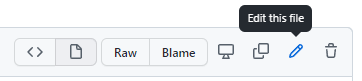
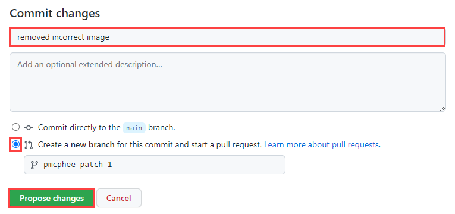

import { Alert } from '@mui/material';
import AlertTitle from '@mui/material/AlertTitle';

[issues]: https://github.com/goscooby/scooby-docs-next/issues
[conduct]: /docs/contributing-guide/code-of-conduct
[repo]: https://github.com/goscooby/scooby-docs-next.git
[pr]: https://github.com/goscooby/scooby-docs-next/pulls
[markdown]: /markdown-reference


Thank you for taking an interest in contributing to the SCOOBY Developer Documentation. 

We've built the documentation with [Docusaurus](https://docusaurus.io) and you can find the source code our [scooby-docs-next GitHub repo][repo].

You're welcome to contribute to the documentation to help make it better and we want to make it possible for you to become a contributor. Additionally, anyone can open an issue about documentation or suggest a change with a [pull request (PR)][pr] to the [GitHub repository][repo]. 

This guide outlines the different ways that you can get involved. In addition, it provides some of the resources that are available to help you get started.

If you plan to contribute, make sure to [set up your environment](#local-git-repo).

## Before you start

- You are familiar with Git and GitHub, and [markdown][markdown]. We use basic markdown, extended markdown, and Docusaurus-specific markdown.
- Review the [documentation repo's][repo] organization and structure. 
- Familiarize yourself with our style guide.
- Verify that you can open a [pull request][pr] and review changes.
- Ensure an [issue][issues] exists. 
- If the solution you are proposing is complex, prose it anyway and wait for one of the core contributors to approve it before implementing it. This helps in shorter turnaround times in merging PRs.
  
  
## When to contribute vs. provide feedback

Our docs are a continuous work in progress. You're welcome to contribute to the documentation to help improve it, and we want to make it possible for you to become a contributor.

### Provide us feedback

If you're not ready to contribute, you can provide us with feedback. Your feedback is essential in shaping the customer content experience. The team will track these ideas and issues to address your feedback. There are several ways to provide feedback:

- Submit an enhancement idea to make the docs better.
- Open a GitHub issue to report an issue with the content (something is incorrect or confusing).

### Contribute

As a contributor, you’ll need to understand the different ways to contribute and which is best based on your changes.

**Does the topic or document exist?**

- If YES, update the doc! Contribute to your heart's content. But first, determine which use case best fits your update:
    - **Minor changes: (use case \#1)** If you only need to fix a typo or clarify a sentence or section, this option is your ideal choice. However, you cannot upload files, such as an image, in this use case, and you can update only one file.
    - **Significant changes: (use case \#2)** Suppose you must make substantial changes, such as adding an image or editing multiple topics. In that case, this method is your best friend, as you'll have one pull request to manage. Consult with the Sr. Technical Writer first before making changes.
- If NO, should it? If so, consider **adding it (use case \#3)**, but don't add a topic or doc just because you can. Consult with the Sr. Technical Writer first before adding. For example, your new topic could be added to an existing one, consolidating and clarifying the information. It's also possible that someone else is working on a similar topic.
- If you're **uncomfortable using GitHub or VS Code or don't have access to GitHub (use case \#4)**, you can provide the Technical Writer a document (Google Docs, Microsoft Word, text file, or Confluence page). The document can be converted to markdown. So don't fret! We'll get your content published.

## Best practices

To promote consistency, follow the guidelines below and mentioned throughout to keep the process productive and beneficial for all involved.

### Content development

- [ ] Verify your content for technical accuracy before submitting your Pull Request.
- [ ] Consult with the Sr. Technical Writer when adding topics or wanting to propose changes to the content structure. The Sr. Technical Writer maintains the content's quality, reduces duplication, and provides a consistent user experience. They can also strategize how to deliver complex information—for example, adding an explainer video (&#060;90 secs) can help with complex scenarios or issues.

### GitHub

- [ ] Create a *working branch* when introducing logically related changes. This helps you manage your changes through the workflow. We refer to it here as a working branch because it's a workspace to iterate or refine your changes until they can be integrated into the default branch.
- [ ] Keep your branch up-to-date.
- [ ] Check and remove unused personal branches periodically for easy maintenance. Usually, when your branch is merged, you can safely delete it.

### Commit messages

Ensure that your commit message is a proper sentence. Refer to this [guide on writing good commit messages](https://cbea.ms/git-commit/).

A properly formed git commit subject line should always be able to complete the following sentence:

**If applied, this commit will ....**

### Pull Requests

- [ ] Try to make the review cycle short.
- [ ] Make sure the markdown follows the style guidelines of this project.
- [ ] Perform a self-review of your markdown, especially spelling errors.
- [ ] Verify that the PR does not generate new warnings before pushing your changes. The best way is to run the clear command.

```nodejs
npm run clear
yarn build
```

## Site organization and files

### Content files

- `/docs/` - Contains the Markdown files for the docs. Customize the order of the docs sidebar in `sidebars.js`.
    - `/docs/images` - Images used in the documentation.
    - `/docs/includes` - Reusable content such as feature descriptions, notes, common steps, etc.
- `versioned_docs` - Contains the markdown files for the previously supported versions.
- `versioned_sidebars` - Contains the sidebar files for the previous versions.
- `/sidebar.js` - Specify the order of documents in the sidebar. If you have a new file to add to the site, modify this file.
- `static/api` - Contains the API documentation for v0 and v1.

### Site config files

- `/docusaurus.config.js` - A config file containing the site configuration.
- `/src/` - Non-documentation files like pages, custom React components, or Docaurus native components.
    - `/src/components` - Custom react components used for the website or included in the documentation, such as the Try It Out!
    - `/src/pages` - Any files within this directory will be converted into a website page. Currently, we don't use this directory.
    - `/src/theme` - Docusausus native components such as the sidebar, content page, and content page footer designs.
- `/static/` - Static directory. Any contents inside here will be copied into the root of the final `build` directory.
    - `/static/img` - Website images such as Beyond Identity logos and other assets.
- `/package.json` - A Docusaurus website is a React app. You can install and use any npm packages you like in them.

## Doc site branches

Before starting the authoring work, you must understand the different branches to work on. You'll use your branch to work on content for a certain issue or feature, but you'll submit your Pull Request against one of the branches listed below:

- `main` - protected branch

    Docs for https://{*domain*}. This branch contains the most recent stable release content.

- `docs-staging` - protected branch

    Docs for the upcoming release. When Secure Customer has a release, its `docs-staging` branch will be merged into `main`.

- Branches starting with `release-` contain archived release documentation for historical tracking, such as `release-xx`.
- `active-development` - protected branch (used for front-end and back-end development).


## Local Git repo

import OnboardingProcessStepper from '../../../src/components/OnboardingProcess.jsx';

<OnboardingProcessStepper />

<details>
  <summary><sub>Optional editing tools</sub></summary>
  <div>
   <p>If you want the WYSIWYG experience, you can install one of the VS Code extensions:
   <ul>
      <li><a href="https://marketplace.visualstudio.com/items?itemName=patmood.rich-markdown-editor">Rich Markdown Editor</a></li>
      <li><a href="https://marketplace.visualstudio.com/items?itemName=zaaack.markdown-editor">Markdown Editor</a></li>
      <li><a href="https://marketplace.visualstudio.com/items?itemName=ryanmcalister.Unotes">UNOTES</a></li>
   </ul>
   </p>
   <p>Other helpful VS Code extensions:
   <ul>
      <li><a href="https://marketplace.visualstudio.com/items?itemName=streetsidesoftware.code-spell-checker">Code Spell Checker</a></li>
      <li><a href="https://marketplace.visualstudio.com/items?itemName=yzhang.markdown-all-in-one">Markdown All in One</a></li>
   </ul>
   </p>
   <p>Non VS Code markdown editors:
   <ul>
      <li><a href="https://stackedit.io/">StackEdit</a></li>
      <li><a href="https://dillinger.io/">Dillinger</a></li>
      <li><a href="https://pandao.github.io/editor.md/en.html">Pandeo MEditor.md</a></li>
   </ul>
   </p>
  </div>
</details>

## Edit content (minor changes)

If you only need to fix a typo or clarify a sentence or section, this option is your best choice. It streamlines the process of reporting and correcting minor errors and omissions in the documentation.  

Despite all efforts, small grammar and spelling errors *do* make their way into our published documents. While you can create GitHub issues to report mistakes, creating a PR to fix the issue is faster and easier when the option is available.

1. In the [repo][repo], navigate to the /docs folder and locate the file you want to edit. Then, select the pencil icon to edit the article. 

   

2. Edit the file in the web editor. Choose the **Preview** tab to check the formatting of your changes.

   

3. When you're finished editing, scroll to the bottom of the page and propose your changes. 

   1. In the **Commit changes** area, enter a title and an optional description for your changes. The title will be the first line of the commit message. 

   2. Select the option to create a branch and then  **Propose changes** to commit your changes.
   
     

4. Now that you've proposed and committed your changes, you need to ask the owners to review your changes. This is done using a pull request (PR). 

   Enter a title and a description for the PR, and then select **Create pull request**. You can select **Create a draft pull request** instead. The difference is that the reviewers are notified only when the PR is *Open* rather than *Draft*.

   


That's it! Team members will review your PR and merge it when approved. You may get feedback requesting changes.


## Edit content (significant changes)

If you need to make substantial changes, add an image or add a section to a topic. On the other hand, if your change is minor that doesn't involve uploading a file or making changes to multiple files, follow the [Edit content - minor change](#edit-content-minor-changes) instructions.

1. Ensure you have [your environment set up](#local-git-repo).

1. Ensure you're back on the `main` (default) branch to sync your local working branch.

   ```
   git checkout main
   git pull origin main
   ```

2. Create a working branch for your proposed changes. For example, **content-dev-faqs** or **release-notes-v25-1**.

   ```
   git checkout -b {branch-name}
   ```

3. Navigate to `/docs` and locate the topic you want to change. 

4. Change the **date** in the metadata and ensure the **title**, **description**, and **author** are correct. Add any additional keywords if they are missing.

   ```markdown
   ---
   title: Getting Started with React
   sidebar_label: React
   id: get-started-react
   description: 'Create a free developer account and connect it to our sample application. This application demonstrates common workflows, like creating realms, applications, and passkeys (public-private key pairs) for user authentication.'
   slug: /get-started-react
   keywords: 
   - get started
   - react
   pagination_next: null
   pagination_prev: null
   last_update: 
      date: 06/01/2023
      author: Patricia McPhee
   draft: false
   doc_type: get-started
   displayed_sidebar: mainSidebar
   ---
   ```

4. Make your changes to the content and run the following command to build and review your changes.

   ```bash
   yarn start
   ```

   This command starts a local development server and opens a browser window. Most changes are reflected live without having to restart the server. If a browser window doesn't open, go to **http://localhost:3000/** to view your local changes.   

1. Perform a self-review of your markdown and make sure your changes or additions follow the [style guidelines](./style-guide.md).

2. Verify that the PR won't generate warnings or errors, such as broken links. If so, address them and ensure it builds without issues.

  ```bash
  npm run clear
  yarn build
  ```

5. When you're ready to submit a pull request, add your changes.

   ```
   git add --all
   ```

6. Commit your changes with a descriptive summary, for example, *Add clarity to the data table component usage examples*.

   ```
   git commit -m "short description of the change"
   ```

   Ensure that your commit message is a proper sentence. Refer to this [guide on writing good commit messages](https://cbea.ms/git-commit/).

   A properly formed git commit subject line should always be able to complete the following sentence:

   **If applied, this commit will ....**

7. Publish, or push, your changes to the main repo for merging. 

   ```
   git push --set-upstream origin {branch name}
   ```

1. [Create a pull request](#create-a-pull-request).

## Add new content

1. Ensure you have [your environment set up](#local-git-repo).

1. Ensure you're back on the `main` (default) branch to sync your local working branch.

   ```
   git checkout main
   git pull origin main
   ```

2. Create a working branch for your proposed changes. For example, **content-dev-faqs** or **release-notes-v25-1**.

   ```
   git checkout -b {branch-name}
   ```

3. Navigate to `/docs` and locate the subdirectory for your new topic.

4. Add the metadata (frontmatter).

   Keywords are optional but helpful. All other metadata is required.

   ```markdown
   ---
   title: Getting Started with React
   sidebar_label: React
   id: get-started-react
   description: 'Create a free Beyond Identity developer account and connect it to our sample application. This application demonstrates common workflows, like creating realms, applications, and passkeys (public-private key pairs) for user authentication.'
   slug: /get-started-react
   keywords: 
   - get started
   - react
   pagination_next: null
   pagination_prev: null
   last_update: 
      date: 06/01/2023
      author: Patricia McPhee
   draft: false
   doc_type: get-started
   displayed_sidebar: mainSidebar
   ---
   ```

5. Add the new markdown file in the sidebar.js file.

   ```javascript
   {
      type: 'category',
      label: 'Foundations',  
      collapsed: false, 
      collapsible: false,     
      link: {
         type: 'doc',
         id: 'foundations/foundations',
      },  
      items: [ 
         'foundations/overview', 
         'foundations/architecture',
         'foundations/passkeys',
         'foundations/configuration',
         'foundations/api-endpoints',
         'foundations/passwordless-connections',
      ],
   },
   ```
   
   It's a best practice to add the markdown file early in the content development phase. Otherwise, you'll get an error when you run the command to build and review your content.

6. Create your content and run the following command to build and review your changes.

   ```
   yarn start
   ```

   This command starts a local development server and opens a browser window. Most changes are reflected live without having to restart the server. If a browser window doesn't open, go to **http://localhost:3000/** to view your local changes.   

1. Perform a self-review of your markdown and make sure your changes or additions follow the [style guidelines](./style-guide.md).

2. Verify that the PR won't generate warnings or errors, such as broken links. If so, address them and ensure it builds without issues.

  ```bash
  npm run clear
  yarn build
  ```

5. When you're ready to submit a pull request, add your changes.

   ```
   git add --all
   ```

6. Commit your changes with a descriptive summary, for example, *Add clarity to the data table component usage examples*.

   ```
   git commit -m "short description of the change"
   ```

   Ensure that your commit message is a proper sentence. Refer to this [guide on writing good commit messages](https://cbea.ms/git-commit/).

   A properly formed git commit subject line should always be able to complete the following sentence:

   **If applied, this commit will ....**

7. Publish, or push, your changes to the main repo for merging. 

   ```
   git push --set-upstream origin {branch name}
   ```

1. [Create a pull request](#create-a-pull-request).

## Create a pull request

import CreatePullRequest from './_pull-request.mdx';

<CreatePullRequest />


