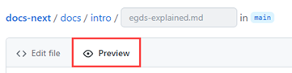
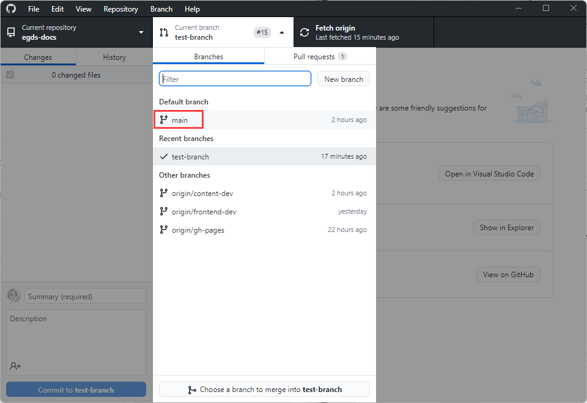
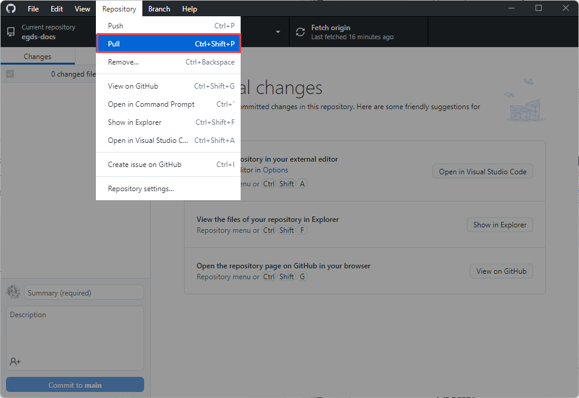
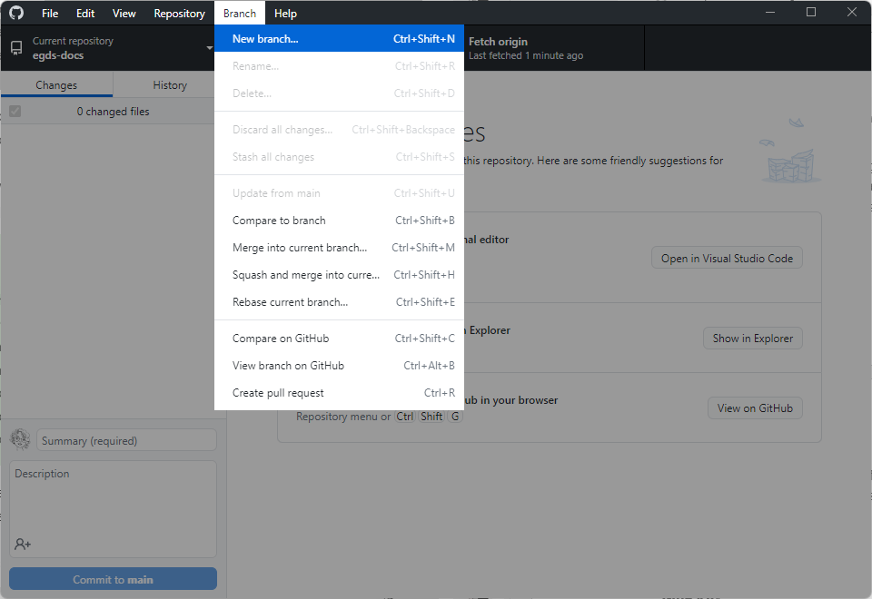
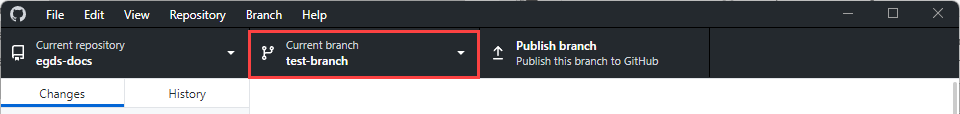
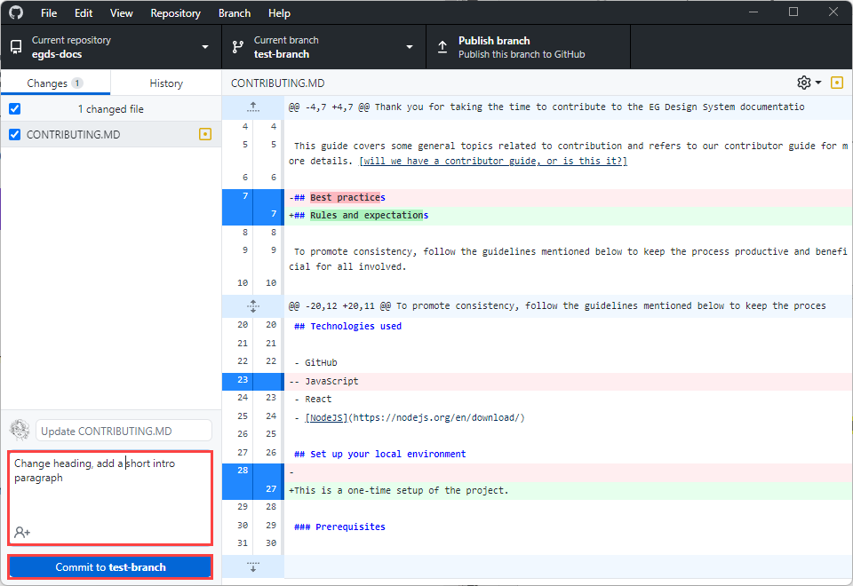
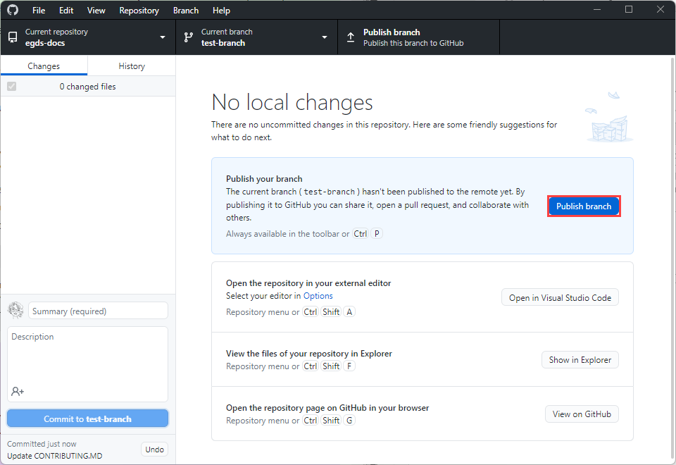
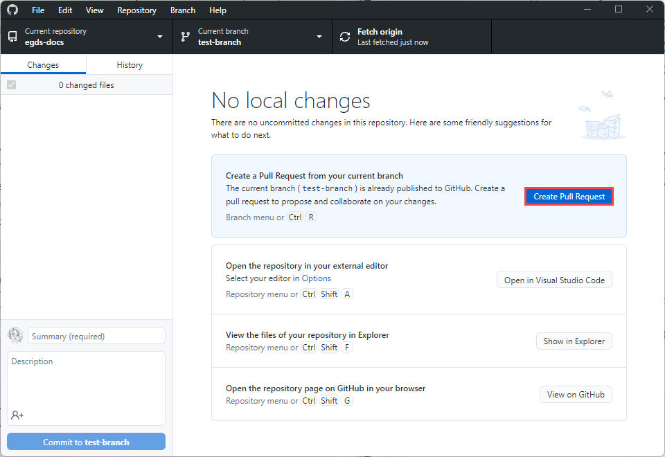
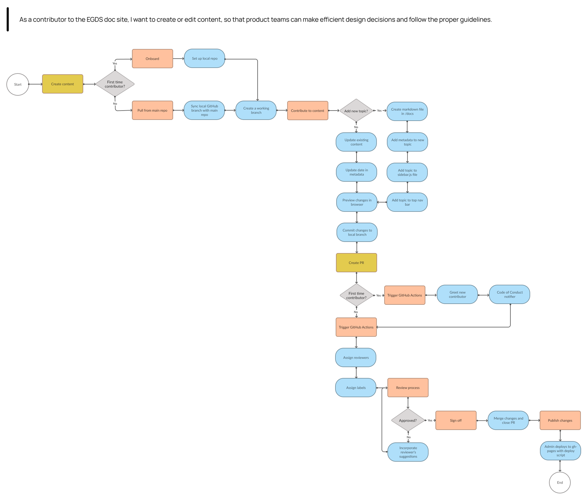

import Tabs from '@theme/Tabs';
import TabItem from '@theme/TabItem';
import OnboardingProcessStepper from '@site/src/components/OnboardingProcess';


Thank you for taking the time to contribute to the SCOOBY Design System documentation. This site is open source, built using [Docusaurus 2.2](https://docusaurus.io/). You'll use markdown, a lightweight markup language, to author the content. This open-source approach streamlines and improves communication between designers, engineers, content teams, and product owners.

## Prerequisites

- Your [environement is setup](./onboard.mdx).

- You understand the [basics of Git](https://git-scm.com/book/en/v2/Getting-Started-Git-Basics) and [markdown](./markdown-reference.mdx).

## When to contribute

When relying on others to draft and review documentation, it makes sense to have a process to make it more productive and encouraging for everyone. 

The acceptance criteria for contributing to SCOOBY documentation is:

**Does the topic or doc exist?**

- If yes, update the doc! Contribute until your heart's content. But first, determine which use case best fits your update:

  - **[Minor changes:](#edit-content-minor-changes)** If you only need to fix a typo or make a clarification to a sentence or section, this option is your best choice. 
    <!--
    <details>
    <summary><b>Show me how!</b></summary>
    <div>
    <video  width="100%" controls src="https://user-images.githubusercontent.com/88200052/199261463-899c36ad-e433-46c9-ac28-87f7e86c1f84.mp4" />
    </div>
    </details>
    -->
    
  - **[Significant changes:](#edit-content-significant-changes)** Suppose you need to make substantial changes, such as adding an image or editing multiple topics. In that case, this method is your best friend, as you'll have one pull request to manage. 

- If not, should it? If so, consider [adding it](#add-new-content), but don't add a topic or doc just because you can. Consult with the SCOOBY Content Design Lead first before adding. 


:::info NOTE
The reason for consulting with the Content Designer is to maintain the highest quality of the content and reduce duplication. For example, your new topic could be added to an existing one, consolidating and clarifying the information. It's also possible that someone else is working on a similar topic. 
:::

### Optional editing tools

<p>If you want the WYSIWYG experience, you can install one of the VS Code extensions:</p>
<ul>
  <li><a href="https://marketplace.visualstudio.com/items?itemName=patmood.rich-markdown-editor">Rich Markdown Editor</a></li>
  <li><a href="https://marketplace.visualstudio.com/items?itemName=zaaack.markdown-editor">Markdown Editor</a></li>
  <li><a href="https://marketplace.visualstudio.com/items?itemName=ryanmcalister.Unotes">UNOTES</a></li>  

</ul>
<p><b>Other helpful VS Code extensions:</b></p>
<ul>
  <li><a href="https://marketplace.visualstudio.com/items?itemName=streetsidesoftware.code-spell-checker">Code Spell Checker</a></li>
  <li><a href="https://marketplace.visualstudio.com/items?itemName=yzhang.markdown-all-in-one">Markdown All in One </a></li>
</ul>

<p><b>Non VS Code markdown editors:</b></p>
<ul>
  <li><a href="https://stackedit.io/">StackEdit</a></li>
  <li><a href="https://dillinger.io/">Dillinger</a></li>
  <li><a href="https://pandao.github.io/editor.md/en.html">Pandeo MEditor.md</a></li>
</ul>

### Best practices

To promote consistency, follow the guidelines below and mentioned throughout to keep the process productive and beneficial for all involved.

- [ ] Always create a *working branch* whenever you introduce a set of logically related changes. This helps you manage your changes through the workflow. We refer to it here as a working branch because it's a workspace to iterate or refine your changes until they can be integrated into the default branch. 

- [ ] The in-browser editing experience is best for minor or infrequent changes. 

- [ ] Always consult with the SCOOBY Content Design Lead when adding topics or want to propose changes to the content structure.  

## Edit content (minor changes)

If you only need to fix a typo or clarify a sentence or section, this option is your best choice. It streamlines the process of reporting and correcting minor errors and omissions in the documentation.  

Despite all efforts, small grammar and spelling errors _do_ make their way into our published documents. While you can create GitHub issues to report mistakes, creating a PR to fix the issue is faster and easier when the option is available.
<!--
<details>
<summary><b>Show me how!</b></summary>
<div>
<video  width="100%" controls src="https://user-images.githubusercontent.com/88200052/199261463-899c36ad-e433-46c9-ac28-87f7e86c1f84.mp4" />
</div>
</details>
-->

1. In the [repo](https://github.com/patriciamcphee/ds-doc-site-prototype), navigate to the /docs folder and locate the file you want to edit. Then, select the pencil icon to edit the article. 

  

2. Edit the file in the web editor. Choose the **Preview** tab to check the formatting of your changes.

  

3. When you're finished editing, scroll to the bottom of the page and propose your changes. 

  a. In the **Commit changes** area, enter a title and an optional description for your changes. The title will be the first line of the commit message. 

  b. Select the option to create a branch and then  **Propose changes** to commit your changes.
   
  

4. Now that you've proposed and committed your changes, you need to ask the owners to review your changes. This is done using a pull request (PR). 

  Enter a title and a description for the PR, and then select **Create pull request**. You can select **Create a draft pull request** instead. The difference is that the reviewers are notified only when the PR is *Open* rather than *Draft*.

  


That's it! Content team members will review your PR and merge it when approved. You may get feedback requesting changes.

## Edit content (significant changes)

If you need to make substantial changes, add an image or add a section to a topic. On the other hand, if your change is minor that doesn't involve uploading a file or making changes to multiple files, follow the [Edit content - minor change](#edit-content-minor-changes) instructions.


<Tabs groupId="git-clients">
<TabItem value="GitHub Desktop" label="GitHub Desktop">

1. Make sure you're back on the main (default) branch so you can sync your local working branch.

  a. Select the Default branch from the <b>Current branch</b> drop-down.

  

  b. Select <b>Repository > Pull</b> to sync your local working branch with the default repo.

  

2. Create a working branch for your proposed changes. For example, **content-dev-faqs** or **update-visual-guidelines**.

  a. Select <b>Branch > New branch</b>.

  

  b. Give your branch a name and select <b>Create branch</b>.

  You'll see the new branch under Current branch.

  

3. Navigate to /docs and locate the topic you want to change. 

  <details>
  <summary><b>Show me how!</b></summary>
  <div>
   <video  width="100%" controls src="https://user-images.githubusercontent.com/88200052/199261867-f7184410-ad9b-49db-8ac6-0cf90f19d47e.mp4" />
  </div>
  </details>

  
4. Change the date in the metadata and ensure the title, description, and author are correct. Add any additional keywords if they are missing.

  ```markdown
  ---
  title: A11y Prerequisites
  permalink: 'a11y/a11y-prerequisites'
  description: 'Learn about guidance and resources on creating accessible and inclusive experiences. 
  Our guidance is based on the Web Content Accessibility Guidelines (WCAG) 2.1 AA standards.'
  keywords:
    - a11y
    - prerequisites
  last_update: 
    date: 09/20/2022
    author: Paige Turner
  ---
  ```

5. Make your changes to the content and run the following command to build and review your changes.

  ```
  yarn start
  ```

  This command starts a local development server and opens a browser window. Most changes are reflected live without having to restart the server. If a browser window doesn\'t open, go to **http://localhost:3000/SCOOBY/docs-next/** to view your local changes. 

6. When ready, commit and publish your changes to the main repo for merging.

  a. Add a commit message, and select <b>Commit to {branch name}</b>.

  

  b. Select <b>Publish branch</b> to push your changes to the upstream repo.

  You might see <b>Publish origin</b> instead, which means this is not a new branch but a branch you've used before to make suggested changes by a reviewer. This could also mean you're reusing the branch that wasn't merged or deleted.

  

  c. Select <b>Create Pull Request</b> so the content reviewers can view the changes and start collaborating.

  

7. From the main (default) branch, select **Compare & pull request**.

  [video here]

8. Provide additional information, add reviewers, and select **Create pull request**.

  Alternatively, you can select **Create draft pull request**.

9. After going through the review process for technical accuracy and a copy edit from a Content Designer, enter `#sign-off` and select **Comment**.

  Your changes get merged into the default branch (`main`).  After each merge, the SCOOBY Content Design Lead reviews all merges, fixes any merge conflicts, and publishes all changes.

</TabItem>
<TabItem value="Git Bash" label="Git Bash">

1. Make sure you're back on the main (default) branch so you can sync your local working branch.

  ```
  git checkout main
  git pull origin main
  ```

2. Create a working branch for your proposed changes. For example, **content-dev-faqs** or **update-visual-guidelines**.

  ```
  git checkout -b {branch-name}
  ```

3. Navigate to /docs and locate the topic you want to change. 

  <details>
  <summary><b>Show me how!</b></summary>
  <div>
   <video  width="100%" controls src="https://user-images.githubusercontent.com/88200052/199261867-f7184410-ad9b-49db-8ac6-0cf90f19d47e.mp4" />
  </div>
  </details>

3. Change the date in the metadata and ensure the title, description, and author are correct. Add any additional keywords if they are missing.

  ```markdown
  ---
  title: A11y Prerequisites
  permalink: 'a11y/a11y-prerequisites'
  description: 'Learn about guidance and resources on creating accessible and inclusive experiences. 
  Our guidance is based on the Web Content Accessibility Guidelines (WCAG) 2.1 AA standards.'
  keywords:
    - a11y
    - prerequisites
  last_update: 
    date: 09/20/2022
    author: Paige Turner
  ---
  ```

4. Make your changes to the content and run the following command to build and review your changes.

  ```
  yarn start
  ```

  This command starts a local development server and opens a browser window. Most changes are reflected live without having to restart the server. If a browser window doesn\'t open, go to **http://localhost:3000/SCOOBY/docs-next/** to view your local changes. 

5. Add your changes.

  ```
  git add --all
  ```

6. Commit your changes.

  ```
  git commit -m "short description of the change"
  ```

7. Publish, or push, your changes to the main repo for merging. 

  ```
  git push --set-upstream origin {branch name}
  ```

8. From the main (default) branch, select **Compare & pull request**.

  [video here]

9. Provide additional information, add reviewers, and select **Create pull request**.

  Alternatively, you can select **Create draft pull request**.

10. After going through the review process for technical accuracy and a copy edit from a Content Designer, enter `#sign-off` and select **Comment**.

  Your changes get merged into the default branch (`main`).  After each merge, the SCOOBY Content Design Lead reviews all merges, fixes any merge conflicts, and publishes all changes.

</TabItem>
</Tabs>


## Add new content


<Tabs groupId="git-clients">
<TabItem value="GitHub Desktop" label="GitHub Desktop">

1. Make sure you're back on the main (default) branch so you can sync your local working branch.

  a. Select the Default branch from the <b>Current branch</b> drop-down.

  

  b. Select <b>Repository > Pull</b> to sync your local working branch with the default repo.

  

2. Create a working branch for your proposed changes. For example, **content-dev-faqs** or **update-visual-guidelines**.

  a. Select <b>Branch > New branch</b>.

  

  b. Give your branch a name and select <b>Create branch</b>.

  You'll see the new branch under Current branch.

  

3. Navigate to `/docs` and locate the topic you want to change. 

  <details>
  <summary><b>Show me how!</b></summary>
  <div>
   <video  width="100%" controls src="https://user-images.githubusercontent.com/88200052/199261867-f7184410-ad9b-49db-8ac6-0cf90f19d47e.mp4" />
  </div>
  </details>

4. Add the metadata (frontmatter).

  Keywords are optional but helpful. All other metadata is required.

  ```markdown
  ---
  title: A11y Prerequisites
  permalink: 'a11y/a11y-prerequisites'
  description: 'Learn about guidance and resources on creating accessible and inclusive experiences. Our guidance is based on the Web Content Accessibility Guidelines (WCAG) 2.1 AA standards.'
  keywords:
    - a11y
    - prerequisites
  last_update: 
    date: 09/20/2022
    author: Paige Turner
  ---
  ```

5. Add the new markdown file in the sidebar.js file.

  ```javascript
  {
    type: 'category',
    label: 'Content',
    link: {
      type: 'doc',
      id: 'content/content-overview',
    },      
    items: [ 'content/language-inclusivity', 'content/grammar-mechanics', 'content/voice-tone-principles', 'content/in-product-word-list', 'content/writing-for-errors', 'content/writing-guidelines' ],
  },
  ```
   
  It's a best practice to add the markdown file early in the content development phase. Otherwise, you\'ll get an error when you run the command to build and review your content.

6. Create your content and run the following command to build and review your changes.

  ```
  yarn start
  ```

  This command starts a local development server and opens a browser window. Most changes are reflected live without having to restart the server. If a browser window doesn\'t open, go to  **http://localhost:3000/SCOOBY/docs-next/** to view your local changes. 

7. When ready, commit and publish your changes to the main repo for merging.

  a. Add a commit message, and select <b>Commit to {branch name}</b>.

  

  b. Select <b>Publish branch</b> to push your changes to the upstream repo.

  You might see <b>Publish origin</b> instead, which means this is not a new branch but a branch you've used before to make suggested changes by a reviewer. This could also mean you're reusing the branch that wasn't merged or deleted.

  

  c. Select <b>Create Pull Request</b> so the content reviewers can view the changes and start collaborating.

  

8. From the main (default) branch, select **Compare & pull request**.

  [video here]

9. Provide additional information, add reviewers, and select **Create pull request**.

  Alternatively, you can select **Create draft pull request**.

10. After going through the review process for technical accuracy and a copy edit from a Content Designer, enter `#sign-off` and select **Comment**.

  Your changes get merged into the default branch (`main`).  After each merge, the SCOOBY Content Design Lead reviews all merges, fixes any merge conflicts, and publishes all changes.

</TabItem>
<TabItem value="Git Bash" label="Git Bash">

1. Make sure you're back on the main (default) branch so you can sync your local working branch.

  ```
  git checkout main
  git pull origin main
  ```

2. Create a working branch for your proposed changes. For example, **content-dev-faqs** or **update-visual-guidelines**.

  ```
  git checkout -b {branch-name}
  ```

3. Navigate to `/docs` and locate the subdirectory for your new topic.

  <details>
  <summary><b>Show me how!</b></summary>
  <div>
   <video  width="100%" controls src="https://user-images.githubusercontent.com/88200052/199261867-f7184410-ad9b-49db-8ac6-0cf90f19d47e.mp4" />
  </div>
  </details>

4. Add the metadata (frontmatter).

  Keywords are optional but helpful. All other metadata is required.

  ```markdown
  ---
  title: A11y Prerequisites
  permalink: 'a11y/a11y-prerequisites'
  description: 'Learn about guidance and resources on creating accessible and inclusive experiences. Our guidance is based on the Web Content Accessibility Guidelines (WCAG) 2.1 AA standards.'
  keywords:
    - a11y
    - prerequisites
  last_update: 
    date: 09/20/2022
    author: Paige Turner
  ---
  ```

5. Add the new markdown file in the sidebar.js file.

  ```javascript
  {
    type: 'category',
    label: 'Content',
    link: {
      type: 'doc',
      id: 'content/content-overview',
    },      
    items: [ 'content/language-inclusivity', 'content/grammar-mechanics', 'content/voice-tone-principles', 'content/in-product-word-list', 'content/writing-for-errors', 'content/writing-guidelines' ],
  },
  ```
   
  It's a best practice to add the markdown file early in the content development phase. Otherwise, you\'ll get an error when you run the command to build and review your content.

6. Create your content and run the following command to build and review your changes.

  ```
  yarn start
  ```

  This command starts a local development server and opens a browser window. Most changes are reflected live without having to restart the server. If a browser window doesn't open, go to  **http://localhost:3000/SCOOBY/docs-next/** to view your local changes. 

7. When ready, commit and publish your changes to the main (default) branch, add your changes.

  ```
  git add --all
  ```

8. Commit your changes with a descriptive summary, for example, *add clarity to the data table component usage examples*.

  ```
  git commit -m "short description of the change"
  ```

9. Publish, or push, your changes to the main repo for merging. 

  ```
  git push --set-upstream origin {branch name}
  ```

10. From the main (default) branch, select **Compare & pull request**.

  [video here]

11. Provide additional information, add reviewers, and select **Create pull request**.

  Alternatively, you can select **Create draft pull request**.

12. After going through the review process for technical accuracy and a copy edit from a Content Designer, enter `#sign-off` and select **Comment**.

  Your changes get merged into the default branch (`main`).  After each merge, the SCOOBY Content Design Lead reviews all merges, fixes any merge conflicts, and publishes all changes.

</TabItem>
</Tabs>


## Pull request process

We use PRs for all changes, even for contributors who have write access. Most repositories protect the default branch so that updates must be submitted as PRs.

If a PR reviewer has reviewed your PR, they can also provide feedback through comments if there are outstanding issues or questions to be resolved before merging.


If you're new to GitHub, see [About pull requests](https://docs.github.com/articles/using-pull-requests) for more information.

<!-- workflow diagram of the pull request process 

-->

## Troubleshoot errors or issues


## How to get support

For questions or to get help with onboarding or contributing, go to the [#SCOOBY-docs](https://patriciamcphee.slack.com/archives/C048ZT7LEKV) channel. 

## Additional resources

-  [Markdown reference guide](./markdown-reference.mdx)

-  [Git terminology](https://help.github.com/articles/github-glossary)

-  [Git basics](https://git-scm.com/book/en/v2/Getting-Started-Git-Basics)

-  [Learning Git and GitHub](https://help.github.com/articles/good-resources-for-learning-git-and-github/)


