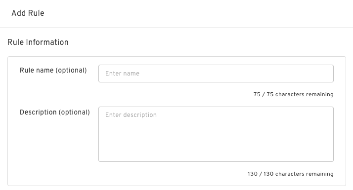
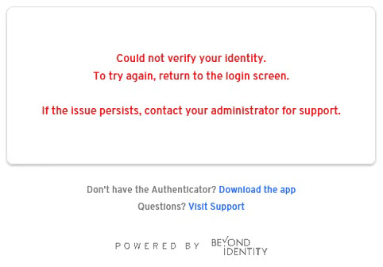

## Cloud

### What's new

You can now add names and descriptions to policy rules.

## Authenticator

import SupportedOsAuthenticator from '../../static/includes/_supported-os-versions.mdx';

<SupportedOsAuthenticator />

### What's new

The integrity of the macOS installation file (dmg) now gets validated before installation.

### Resolved

* After creating a custom deny policy, the custom deny message didn't display on Android devices.

* If a user had two or more accounts on their Android device and didn't select an account before switching from the app, authentication prompts no longer appeared until the Beyond Identity app was forcefully closed and reopened.

* When attempting to authenticate through the Microsoft Edge browser using IE mode, the "_Could not verify your identity_" message appeared.
    
&nbsp;&nbsp;&nbsp;&nbsp;&nbsp;&nbsp;&nbsp;&nbsp;