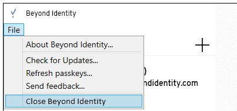
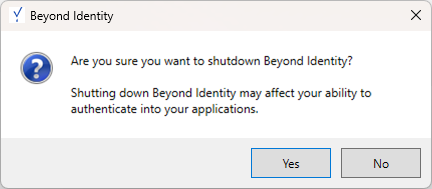

## Cloud

We resolved the issue when switching between policy rules, the policy attributes with multiple fields didn't immediately update the values. Instead, showing the values from the previously selected rule.  

## Authenticators

import SupportedOsAuthenticator from '../../static/includes/_supported-os-versions.mdx';

<SupportedOsAuthenticator />
 

We made the Windows Authenticator application more consistent with the Mac version. Windows users tend to close the application more often than Mac users, which has significantly impacted their authentication performance.

Here are the changes we made:

- Renamed **Exit** under the **File** menu of the Authenticator to **Close Beyond Identity**. Selecting this menu item minimizes the Authenticator application to the Windows Task Tray. Likewise, closing the window from the upper right (X) or selecting Close from the Authenticator's system menu minimizes the Authenticator application to the task tray.

  

- Renamed **Exit Beyond Identity** to **Shutdown Beyond Identity** in the Windows Task Tray context menu. Right-clicking the application icon in the task tray is now the only way to completely shut down the Windows PA.

  

- Changed the message displayed when shutting down the application from the task tray, warning the user that this action may impact authentication.

  

## Desktop Login

<SupportedOsAuthenticator />

### Updated

- Security around the usage of Recovery Keys was improved. Therefore, we advise all customers utilizing recovery keys to update to the latest version.

- RDP support was improved. 
    
  **Caveats**

  - Both host and destination machines **must** be domain joined and visible to the domain controller.

  - Only **one** domain user is supported at this time. For example, _**test.user > test.user**_ is valid; however, _**test.user > test.user2**_ is invalid.

  - When using AAD, Network Level Authentication (NLA) may need to be disabled on the target machine.
    
  **Not supported**
    
  - Onboarding case where a domain user still needs to log into the machine.
  
  - Lock within an RDP session with AAD-joined machines.
  
  - UPN format when using RDP within AAD environments.

### Resolved

When using RDP with Windows Desktop Login, users entered their PIN twice. Once to start the RDP session and again to login to the session.

