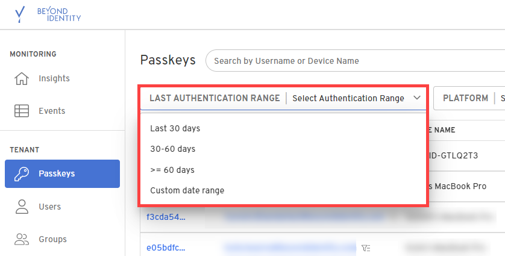
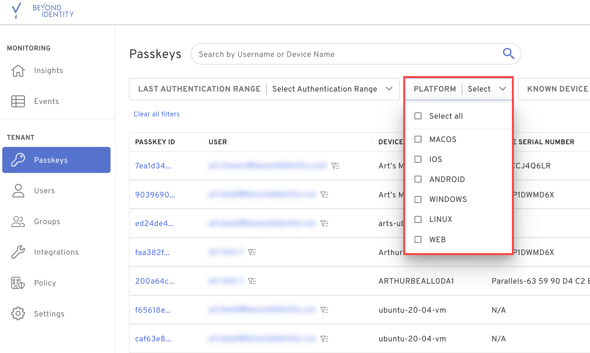
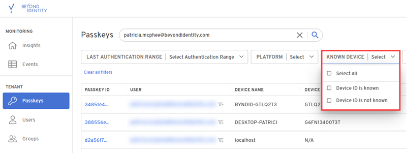
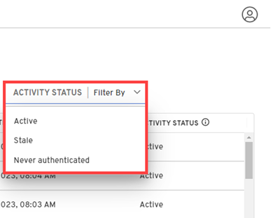

## Cloud

You can now manage all passkeys across your tenant in one central location. For example, quickly identify how many passkeys a user has and which ones are stale (not authenticated in 60+ days). 

- Quickly identify when a user last authenticated in the last 30 days, 30-60 days, or more than 60 days. You can also customize the authentication date range to search for passkey activity based on what you deem stale or inactive.

  

  

- Filter the list of passkeys by platform to see how many macOS, iOS, Windows, Linux, Android, or web endpoints are associated with passkeys in your tenant.

  

- Quickly identify passkeys associated with devices with serial numbers using the "Known Devices" filter.

  

- Filter your passkey list based on its activity status (stale, active, never authenticated).

  

- Check to see if any passkeys are on jailbroken or rooted devices.

- In a future release, you'll be able to revoke passkeys in bulk and export them to CSV. 

## Authenticator

import SupportedOsAuthenticator from '../../static/includes/_supported-os-versions.mdx';

<SupportedOsAuthenticator />

We updated how Android users of the Beyond Identity Platform Authenticator. They are now required to **Allow Notifications** on their Android devices.  

## Desktop Login

<SupportedOsAuthenticator />

### What's new

Users can now use the Beyond Identity Windows Desktop Login with Microsoft Windows Roaming Profile. For installation instructions and supported configurations, see the implementation guide. 

### Improved

Users must now specify a Tenant ID with Beyond Identity Active Directory Connector. An Active Directory Admin typically performs this action.

### Resolved

When logged into a remote system through Windows Remote Desktop and the session locks, the user can now provide their Beyond Identity Windows Desktop Login PIN to unlock the system. 
