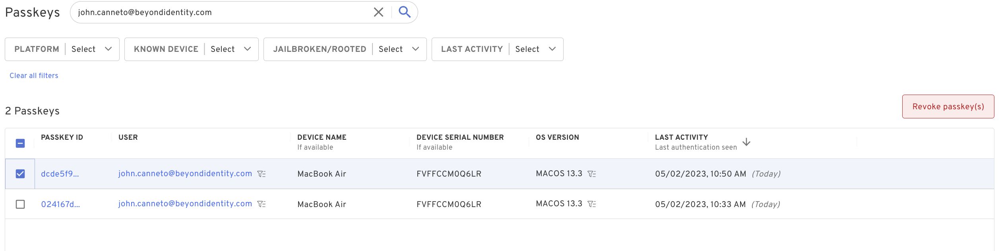
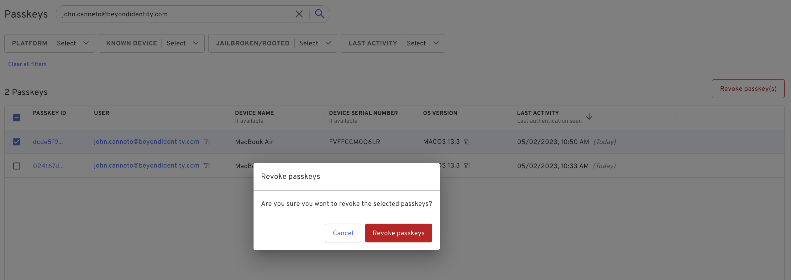
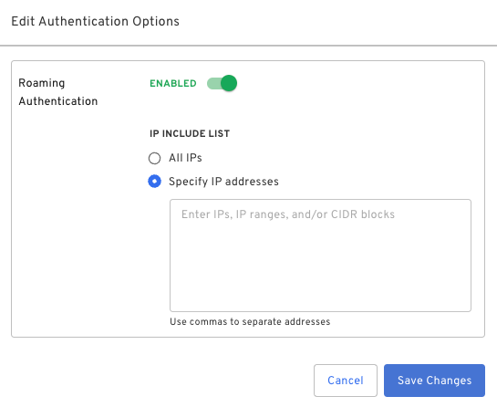
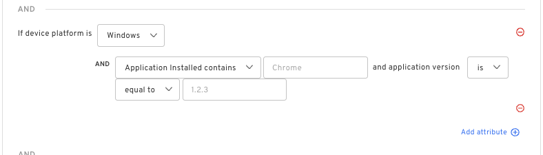
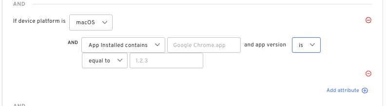
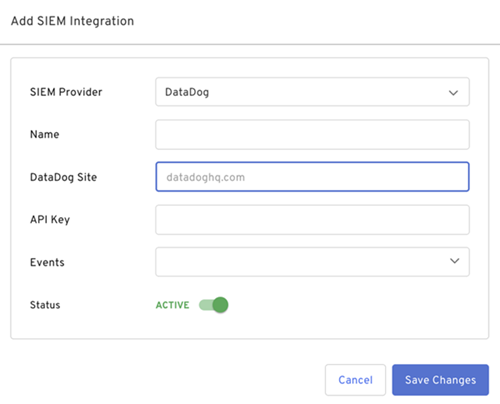
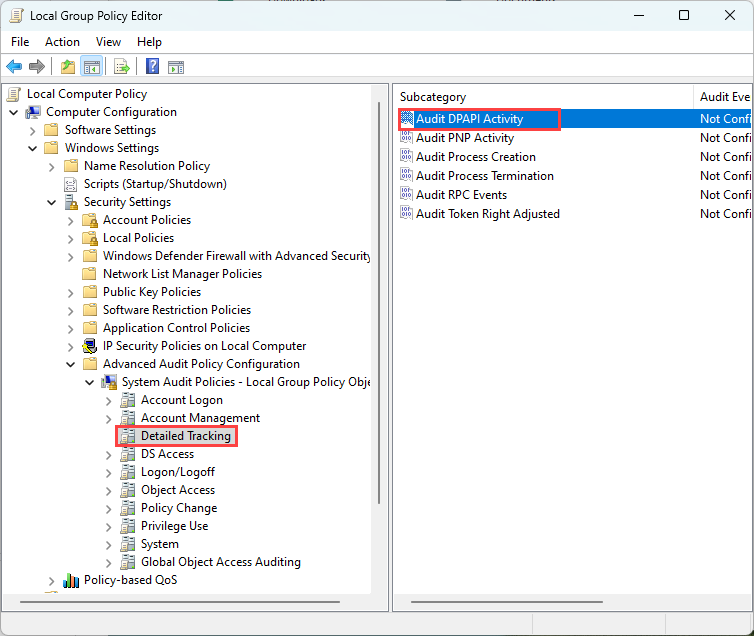

import ReactPlayer from 'react-player'
import serverSetup from '../../static/videos/WDL-Password-Change-Server-Setup.mp4'
import userSessionLog from '../../static/videos/WDL-Password-Change-User-Session-Log.mp4'

## Cloud

### Bulk Revoke Passkeys 

New!

You can now revoke multiple passkeys directly from the passkey table. This allows you to quickly identify stale or unwanted passkeys and remove them with a few clicks.

:::caution 
This action is permanent and cannot be recovered once done.
:::

### Roaming Authentication Scope

New!

You can now scope Roaming Authentication to enable configured source IP addresses.  It allows for more granular control over the sources roaming authentication is enabled for for the sources that QR code is dplayed.  For example, configure source IP addresses of an organization's ISPs to enable roaming authentication from these locations only.

Configure this under **Settings > Authentication Options > Roaming Authentication**.

### Policy Attribute: Applications Installed

New!

The Applications Installed attribute now supports matching on application versions for Windows and macOS. Leverage this attribute to match policy rules based on applications installed on endpoint devices. Note: Matching on versions currently supports numeric versions only.

### Policy Action: Allow w/Biometric Verification

New!

Beyond Identity administrators can now enforce users to leverage biometrics as a step up/additional factor. The biometric-only option can be configured using the Beyond Identity policy engine, and does not permit an end user to fall back to the operating password or PIN to satisfy the additional factor. If configured, the user will receive a _denied_ notification when they attempt to authenticate if biometrics are not satisfied or are not available.

### DataDog SIEM Integration Enhancement

New!

Because Datadog offers independent sites based on data governance regulations, you must select the proper site parameter to properly connect to our event HTTP listener. We’ve added a new field that allows you to do so. The default example corresponds to the US1 location. However, you can now modify this according to the site corresponding to your data's location. For more information about DataDog site parameters, see [Getting Started with Datadog Sites](https://docs.datadoghq.com/getting_started/site/).

## Desktop Login
Improved!

We improved the **Password Change/Reset in Windows Desktop Login**. WDL now detects when the user changes their password and automatically re-caches the BI credentials without needing the user to unlock or re-login while offline. Previously, login credentials were automatically re-cached whenever the user logins or locks and unlocks via WDL.

:::caution
The Password change assist only works for Domain Local and Hybrid, it does not work for Azure Only.
:::

The details of the new solution are:

- **Local Account:** If the user changes their password and their account is a local only account, Windows produces an Event Log message specifying that the password changed. Specifically, Windows trigger event **#4723** if the user changes their own password, and **#4724** if an Admin changes another user’s password. WDL listens for both of these password change events and re-caches the WDL credentials whenever it receives either event.

- **Domain or hybrid Azure AD/Domain:** In a domain or a hybrid Azure AD/Domain environment, the domain controller receives the password changed event(s) instead of the client. However, event **#4693** indicates that the DPAPI master key was recovered. This event is triggered on the client at least once whenever the user changes their password on a domain. WDL listens for this event and re-caches the WDL credentials whenever it receives it. Additionally, event **#4693** is not enabled by default, so you’ll need to enable domain clients to receive this message.

  Apply the following settings for the Group Policy under the OU for your Beyond Identity users/clients.

  1. On the Domain Controller, open the **Group Policy Editor**.

  2. Edit the Default Group Policy or the applicable OU policy. Go to **Computer Configuration > Windows Settings > Security Settings > Advanced Audit Policy Configuration > System Audit Policies - Local Group Policy Object > Detailed Tracking**.

  3. Open the **Audit DPAPI Activity** properties, select the **Success and Failure** options, and click **OK** to save the configuration.

  4. Close the Group Policy Editor and ensure that the new Group Policy is pushed out to all the clients.

   

- **Azure AD Only:** Currently, WDL cannot detect that a user changed their password in an Azure AD Only environment. So, in an Azure AD Only environment the user must login again or lock/unlock while still online.

### Server setup

In this explainer video, we cover how to set the Group Policy.

<ReactPlayer
   url={serverSetup}
   height='auto'
   width='600px'
   controls='true'
/>

### Password change user session log

In this explainer vide, we go over the initial problems with the old solution and why we went with the new solution.

<ReactPlayer
   url={userSessionLog}
   height='auto'
   width='600px'
   controls='true'
/>
