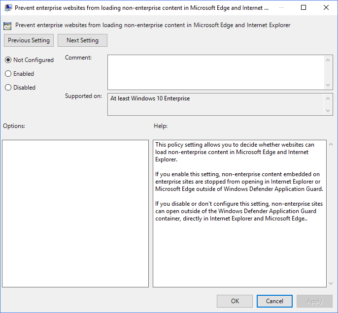
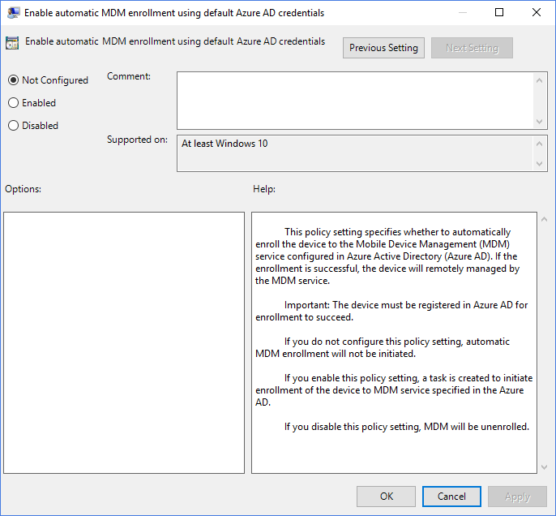
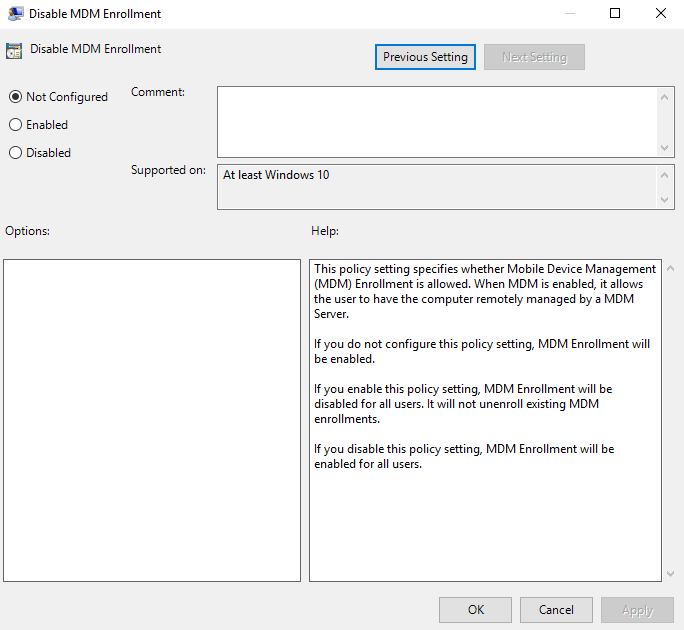

A Group Policy has both control labels and in-platform microcopy (status UI text).  The static UI text provides users with detailed instructions or explanations to make informed decisions.  

Group policies are common settings that system administrators configure for the enterprise. In these examples, the group policies to configure are found in the Group Policy Editor in Windows 10. 

:::note
Also, these examples are specific to the Microsoft Edge (legacy) browser. 
:::

>**Project:**  UX writing challenge   
>**Description:** Simplify, simplify, simplify.  Here I wanted to continue what I had been doing while as an FTE with Microsoft - reworking the Microsoft Edge Group Policies for the IT Pros. What I found during my initial rewrite was that the dependencies weren't idenfied. For example, if the policy relied on another one to work correctly, the IT Professional wouldn't know this because the in-platform microcopy or user documentation didn't indicate this dependency.  
>**Date of the rewrite:** January 8, 2019    
>**Date last modified:** February 12, 2022

## Do not sync browser setting 

### Original

Prevent the "browser" group from syncing to and from this PC. It turns off and disables the "browser" group on the "sync your settings" page in PC settings. The "browser" group contains settings and info like history and favorites.

If you enable this policy setting, the "browser" group, including history and favorites, will not be synced.

Use the option "Allow users to turn browser syncing on" so that syncing is turned off by default but not disabled.

If you do not set or disable this setting, syncing of the "browser" group is on by default and configuration by the user.

### Rewrite 

By default, the "browser" group syncs between users' devices automatically, allowing them to make changes. In addition, the "browser" group uses the **Sync your Settings** option in Settings for syncing information like history and favorites.

| Setting | Description |
| ------- | ----------- |
| Disabled or not configured **(default)** | Allowed/turned on |
| Enabled | Prevent/turned off |

>> **Related policies:** Prevent users from turning on browser syncing.

## Prevent enterprise websites from loading non-enterprise content

### Original

### Rewrite 

By default, non-enterprise sites open in Internet Explorer and Microsoft Edge outside of the Windows Defender Application Guard container.

| Setting | Description |
| ------- | ----------- |
| Disabled or not configured **(default)** | Allowed |
| Enabled | Prevent |

## Enable automatic MDM enrollment using default Azure AD credentials

### Original 

### Rewrite

With this policy, you can enroll a device to the Mobile Device Management (MDM) service configured in Azure Active Directory (AAD) automatically.  The device must be registered in AAD for enrollment to succeed. Once enrolled, the device gets managed remotely by the MDM service.  

| Setting | Description |
| ------- | ----------- |
| Not configured **(default)** | Automatic MDM enrollment does not initiate.  |
| Disabled | Unenroll from MDM. |
| Enabled | A task gets created to initiate MDM enrollment. |

## Disable MDM Enrollment

### Original 

### Rewrite

With this policy, you can prevent Mobile Device Management (MDM) enrollment for all users.   

| Setting | Description |
| ------- | ----------- |
| Disabled or not configured **(default)** | Automatic MDM enrollment initiates. Enable MDM enrollment for all users. |
| Enabled | Disable MDM enrollment for all users. It does not unenroll existing MDM enrollments. |