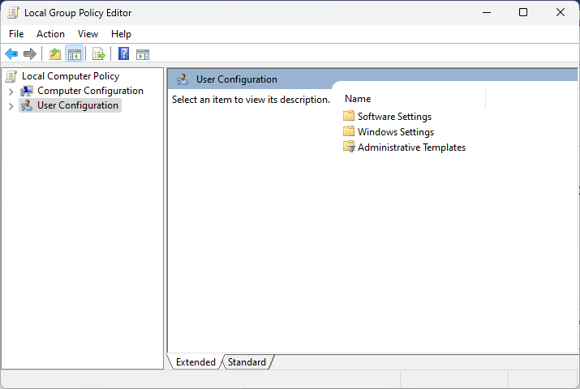

Group policies are common settings that system administrators configure for an enterprise. These policies have control labels and in-platform microcopy that give users detailed instructions or explanations to make informed decisions. 

The following examples are group policies found in the Group Policy Editor in Windows 10/11. The original microcopy is shown on the left, and the rewrite is on the right.

## Allow search engine customization

<iframe width="980" height="600" src="https://www.figma.com/embed?embed_host=share&url=https%3A%2F%2Fwww.figma.com%2Ffile%2FR9H8wCBqTHUZdbmtxdsv3l%2FPatricia-McPhee's-UX-Writing-Portfolio%3Fnode-id%3D893%253A5148%26t%3DXlAImWQUfjmRexlD-1" allowfullscreen></iframe>

## Prevent using LocalHost IP address for WebRTC

<iframe width="980" height="600" src="https://www.figma.com/embed?embed_host=share&url=https%3A%2F%2Fwww.figma.com%2Ffile%2FR9H8wCBqTHUZdbmtxdsv3l%2FPatricia-McPhee's-UX-Writing-Portfolio%3Fnode-id%3D893%253A5153%26t%3DXlAImWQUfjmRexlD-1" allowfullscreen></iframe>

## Allow only system backup

<iframe width="980" height="600" src="https://www.figma.com/embed?embed_host=share&url=https%3A%2F%2Fwww.figma.com%2Ffile%2FR9H8wCBqTHUZdbmtxdsv3l%2FPatricia-McPhee's-UX-Writing-Portfolio%3Fnode-id%3D1007%253A3721%26t%3DoamaxtivsiQYHXg2-1" allowfullscreen></iframe>