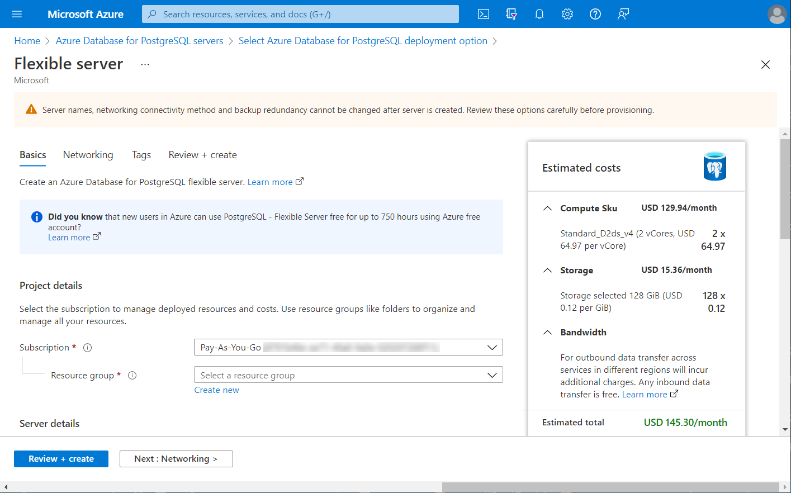

UX writing is the practice of designing the words people see and hear when they interact with software. It's the type of writing that guides users as they interact with the product. Ultimately, it's about designing the conversation between a product and its user. 

User interface text, or UI strings, appear on UI spaces and includes:

- **Control labels** identify controls and are placed directly on or next to the controls.

- **Static text** is not part of interactive control and provides users with detailed instructions or explanations to make informed decisions. Take the Azure portal, for example. Azure does an excellent job providing static text that offers helpful guidance. In addition, it often has a **Learn more** link to the user documentation.

  
  

## Design concepts

It's frequently thought that UI text is written after writing the code and relegated to product documentation and technical support. In reality, the UI text is written earlier as the UI is designed and coded. This text is seen more frequently than perhaps any other type of technical writing.

Comprehensible text is crucial to effective UI. Product managers and software developers should work with technical writers or UX writers on UI text. Writing the UI text is a critical part of the design process because text problems often reveal design problems. If the team has trouble explaining a design, it is often the design, not the explanation, that needs improving.

>*Forrester reports words in software have the most impact on user engagement with four times the conversion differential on text.*[^1]

## Design considerations for UI text

Consider the following when you think about the UI text and its placement in the UI:
- People read in a left-to-right, top-to-bottom order (in Western cultures).

- Users aren't immersed in the UI itself. They're immersed in their work when using the software. 

- Users don't read UI text; ***they scan it***. When scanning, users may appear to be reading text when filtering it in reality. However, they often don't truly comprehend the UI text unless they perceive the need.

- Within a window, different UI elements receive different levels of attention. Users tend to read control labels first, especially those that appear relevant to completing the task at hand. By contrast, users tend to read static text only when they think they need to.

Also assume that once users have decided what to do, they will immediately stop reading and do it.

[^1]: "Making experience your business is good for your business." (Forrester) March 2018.
## Error messages

Writing error messages can be challenging because you want them to be short but have enough information to help the user. Your overall goal is to provide guidance to the user to prevent dead ends. So, what does "dead end" mean in this context? It means the user is stuck at a dead end because the message doesn't give them the next steps to fix it themselves. 

:::tip
If you're able to spin what could be a negative into a positive, you're more likely to keep that user around and improve their user journey.
:::

For example, if they get an "Invalid or unsupported file type. Please try again." error, do they know what to do next? This message is a good example of a dead-end message. It doesn't tell the user what supported file types to try to get past the error. You can find the rewrite to this example below.
