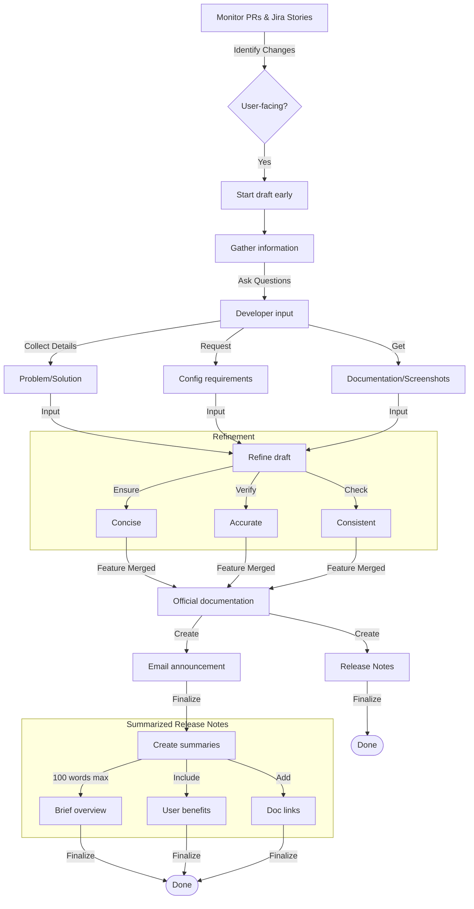

When created thoughtfully, release notes are powerful user engagement and retention tools. They can significantly impact user satisfaction and product adoption. In this topic, you'll find the principles, best practices, and process for writing effective release notes that inform users about new features, enhancements, and bug fixes in your product.

Following these guidelines and standards helps maintain a proactive approach. Your release notes will accurately capture user-facing changes and be ready when features go live. This approach keeps end-users well-informed while fostering a more collaborative documentation cycle within your team.

## Why do I need release notes?

Release notes are an opportunity to keep users excited about your product, serving as a gateway to deeper information. They provide a clear, non-technical record of software changes, allowing stakeholders to understand what’s changed and why without needing to parse technical changelogs.

They are essential for several reasons:

- **Transparency:** Regular updates demonstrate active product maintenance and stakeholder care.
- **Support minimization:** They inform stakeholders about new features, updates, and known issues, potentially reducing support tickets.
- **Clarity:** They provide a clear, non-technical record of software changes, allowing stakeholders to understand what’s changed and why without needing to parse technical changelogs.

## Differences between changelogs and release notes

Release notes differ fundamentally from changelogs in their audience and approach:

| Release Notes | Changelogs |
| --- | --- |
| Customer-focused | Developer-focused |
| Uses plain language | Uses technical language |
| Requires research to understand features, functionality, and user experience | Light effort as it relates closely to developers’ current work |
| Describes changes affecting user experience; can include media and links to user documentation | Reverse chronological list of code changes; can include links to pull requests, issue numbers, or commits |
| Includes what changed and why | Links to the developer who made the change and specific issues |
| Typically written by a Technical Writer or Product Manager | Typically written by a Software Developer based on commit messages |

## Tips and best practices

It can be challenging to write release notes. Even the most minor product change requires carefully considering how it’s written. However, it doesn’t need to be a challenge. 

To write them effectively:

1. Don’t leave release notes until the last minute, rushing to put something together. If rushed, you risk not clearly articulating the value of the new features, updates, or fixes.  Make them an **ongoing** task instead of a post-release scramble. This approach reduces errors, ensures thorough developer feedback, and enables **timely** communication.
2. Write release notes drafts alongside development. Writing as development progresses avoids last-minute scrambling and ensures accurate details while they are fresh.
    - Engage in daily stand-ups or sprint reviews to understand incoming features.
    - Use development milestones or status updates to gauge release timelines.
    - Reference the Jira descriptions and acceptance criteria when writing release notes. The process becomes smoother when Jira items align with the established template.
3. Focus on user-facing impact. Include:
    - **What was added or changed** - feature, improvement, or bug fix
    - **Why it matters** - impact on user experience (user benefit)
    - Provide links to documentation, tutorials, and how-to guides because release notes are a gateway to deeper information. While this requires coordinating to ensure all supporting materials are ready before launch, the effort enhances users’ value.
4. Leverage a single source of truth by keeping a dedicated area outside Jira (like a project board or spreadsheet) where you list all potential release note items. This ensures you don’t forget anything when finalizing notes.
5. Use a consistent format and style. Write in a clear, positive tone that engages readers. Use "you" and "your" for direct address, maintain consistent formatting and terminology, favor plain language over jargon, and use present tense for features but past tense for bug fixes. This consistency helps users quickly scan and understand the content.
6. Keep it simple. Remember that many readers may not be native English speakers. Check this [list of human words for technical docs](https://coda.io/@dave-connis/human-words-for-technical-docs) if you need help simplifying your language!
6. Use only production-ready screenshots. Using test content in screenshots can make release notes appear unprofessional and incomplete, which may cause confusion.


## Process flow

Writing release notes is a structured process that involves several steps. This flowchart outlines the key steps to follow when drafting release notes:



1. Keep an eye on incoming PRs in GitHub and track Jira stories as they near completion. This visibility helps you **quickly identify** potential user-facing changes and prepare release notes.
2. Review each change—UI modifications, backend enhancements, bug fixes—and ask yourself, “Does the user need to know this or will it change their experience?” If **yes**, it belongs in the release notes.
3. Start drafting before a feature is merged if it’s likely to ship.  This **keeps you ahead**. 
    
    :::tip
    If a feature is delayed, you can reuse the draft for the next release.
    :::
    
4. Once you’ve identified a user-facing change, and the Jira story isn’t straightforward, **ask questions** to get precise details:
    - What problem does this solve for the user?
    - Are there any new configurations or steps required?
    - Is there documentation or screenshots to include?
    
    Developers move on quickly after completing a feature, so asking questions promptly ensures **accurate and timely** information.
    
5. Refine your draft to ensure it’s:
    - **Concise**: Keep it user-focused and easy to read.
    - **Accurate**: Double-check technical details (version numbers, configuration steps, etc.).
    - **Consistent**: Align with your existing style guide, formatting, and terminology.
    
    Confirming details prevents last-minute confusion and ensures a **professional and coherent** release note.
    
6. Once the feature is **approved and merged** into the main branch:
    1. Add your release note to the **official release notes** (the Docusaurus blog feature).
    2. Prepare or update the **email announcement** using the pre-defined template.
    
    Doing this maintains **alignment between development and documentation**.
    
7. Summarize each feature or update from the release notes for the release announcement email that goes out to users. These summaries provide quick overviews and guide users to relevant sections where they can dive deeper into the official release notes and end-user documentation. 
    
    Each summary should:
    
    - Be 100 words or less.
    - Include a clear benefit or value to the user.
    - Provide links to documentation for further details.

## Example scenario

1. A developer merges a PR about adding a **Fix Me** button to the UI.
2. Does this affect user interaction and their experience? Absolutely—new UI element.
3. Start writing a short overview: “A new **Fix Me** button lets users quickly...”.
4. If the Jira story isn’t straightforward, ask the developer what scenario triggers the button and any limitations.
5. Update the note with final details when the code is tested and merged.

## Format and structure

A well-structured release notes document uses a standardized format to make information easy to find and understand. Key components include:

- A **title** that consists of the product's release number, for example, _v1.11.0 Release Notes_.
- A concise, **high-level summary** of key changes, highlight major updates in one or two sentences.
- **Sections** that outline and explain new functionality and detailed updates or optimizations to existing features.
- (Optional) Inform users about unresolved problems that have workarounds.

This consistent structure helps stakeholders quickly understand changes and their impact while presenting product updates organized professionally.

### Content guidelines

The content should focus on user impact and value:

| Include | Exclude |
| --- | --- |
| User-facing changes and workflow modifications | Incomplete or partially ready features |
| Fixed bugs from the current sprint | Client-specific content |
| Performance improvements explained in user terms | Test content in screenshots |
| Screenshots that demonstrate changes | Internal terminology and technical jargon |
| Links to supporting documentation |  |

### Style principles

| Clear Communication | Formatting Standards |
| --- | --- |
| Write at an eighth-grade reading level | Use **bold** for UI elements |
| Use active voice and direct language | Use *italics* for user input and errors |
| Address readers as "you" | Match UI capitalization exactly |
| Avoid buzzwords and subjective descriptions | Maintain consistent heading hierarchy |
| Choose clarity over brevity | Avoid quotation marks except for direct quotes |

### When to include screenshots

The answer is simple: whenever they add value. Here are some questions to guide you. If the answer is ***yes***, add a screenshot:

- Did the look and feel change?
- Is the item altering the user's workflow?
- Did a UI element move to a new location?
- Would a screenshot help users understand better?

:::tip Pro tip
For features that need navigation help or interaction clarity, a GIF works even better.
:::

### Formulas for writing new features

When writing about new product features, consider using the following formulas to structure your content effectively.

#### Formula 1

- [ ]  You can now \{describe what you can do with the feature\}.
- [ ]  This means you can \{benefit\}.
- [ ]  See \{link to topic name\} for more details.

**Example**

You can now quickly access your most recent transactions using the Personal Log feature. This means you can select the last five transactions you accessed from a menu while speaking with a customer. You can also perform an extensive search to find specific transactions in your queues. See [**Personal Log**](http://example.com/) for more details.

#### Formula 2

- [ ]  \{The application\} now provides \{feature\}...
- [ ]  …\{benefit\}.
- [ ]  See \{link\} for more details.

**Example**

Software X now provides a Personal Log feature, allowing you to access your most recent transactions quickly. See [**Personal Log**](http://example.com/) for more details.

### Formula for writing improvements

When writing about improvements or enhancements, consider using the following formula to structure your content effectively.

- [ ]  \{Describe what was added, updated, or removed\}.
- [ ]  \{Describe the benefit\}.
- [ ]  See \{link to user documentation\}.
    
**Example**

In addition to viewing the Accept, Challenge, and Deny recommendations in a pie chart, you can now export the data. Risk Analysts can manipulate this data to analyze the recommendations further. See the [**Recommendations Widget**](http://example.com/).

### Formula for writing known issues 

These are unresolved technical problems identified in the current software release that impact user experience. Each known issue must include a clear, actionable workaround—an alternative solution users can follow until a fix is implemented. Including only issues with workarounds in release notes ensures clarity and transparency, providing users with practical solutions to address challenges effectively.

When writing about a known issue with actionable workarounds:
- [ ]  \{describe the scenario or problem\}.
- [ ]  \{explain how the workaround resolves or mitigates the issue\}.
- [ ]  See \{link to relevant documentation\}.

**Example**

If you set the **`refreshToken`** to **`true`** and are migrating from version 5.x to 6.x, scheduled jobs will no longer work. JWT tokens generated before MySoftware 6.x are incompatible with the offline tokens used in MySoftware 6.x. To fix this, each user must log out of MySoftware and then log back in. See [Upgrading to MySoftware 6.x](#) for additional details.

---

## Creating release notes

You'll use the **blog** feature in [Docusaurus 2.4.1](https://docusaurus.io/docs) for the release notes. 

### Prerequisites

- **Docusaurus project**: Ensure you have a Docusaurus project set up and running.


### 1. Create a new Markdown file

Create a new file and name it something that makes sense for your release, for example:

```
/blog/xx.xx.xx/2025-mm-dd-release-notes.md
```

:::tip
Use the date in the filename for sorting and clarity, for example, `2025-01-04-release-notes.md`. This format is used as the date for the release notes in the blog section. 
:::

### 2. Add the front matter (metadata)

At the very top of your new Markdown file, add the front matter. This is essential for Docusaurus to properly parse and display your release notes in the blog section. The front matter is enclosed by three dashes (`---`) and might include:

- **slug**: The URL path segment for this post
- **title**: The title shown for the release notes
- **tags**: Any keywords or categories you want to associate with your post

Here’s an example front matter block:

```yaml
---
slug: 1-10-0-release-notes # URL path segment
title: v1.10.x Release Notes # Title shown for the release notes
tags: [ template visibility, templates, onboarding, plugins, widgets, servicenow, devops, secrets management, entity validation, webex plugin, jira] # Keywords or categories
---
```

:::note important
Use only valid YAML here (no trailing commas, proper string escaping). Mistakes can cause Docusaurus to fail when building the site.
:::

### 3. Use the truncate marker

Docusaurus uses the `<!--truncate-->` marker to define the preview (excerpt) of the blog post. Whatever you place before this marker is considered the excerpt. Anything after it only appears once the user opens the full blog post.

Here is an example:

```md
We're thrilled to announce that v1.10.0 is live with enhancements and new features!

<!--truncate-->

Here’s a quick look at what’s new:

## New features
```

:::tip
If you omit the `<!--truncate-->` marker, Docusaurus might show the entire post or generate a shorter excerpt automatically.
:::

### 4. Format your content

You can use standard Markdown formatting to structure your release notes. Use headings to break down your updates. For example:

```md
## New Features

### Feature A

### Feature B

## Enhancements

### Enhancement 1

### Enhancement 2
```

### 5. Review and preview your release notes

Before you commit your file:

1. Ensure your headings and lists are descriptive.  
2. Make sure your front matter is correct and doesn’t contain syntax errors.  
3. If you have Docusaurus set up locally, run `npm start` or `yarn start` to preview your blog post on the local dev server.

### 6. Publish your release notes

Once you’re satisfied:

1. **Commit** your new Markdown file to your repository.  
2. **Push** your changes to your deployment branch and open a Pull Request.  

When Docusaurus builds your site (locally or via CI/CD), your release notes will appear in the **Blog** section under the slug you defined.

### Full example

Here’s the complete example combining everything described:

```yaml
---
slug: 1-10-0-release-notes
title: v1.10.x Release Notes
tags: [ template visibility, templates, onboarding, plugins, widgets, servicenow, devops, secrets management, entity validation, webex plugin, jira]
---

We're thrilled to announce that v1.10.0 is live with enhancements and new features!

<!--truncate-->

Here’s a quick look at what’s new:

## Conditional visibility of templates

We’ve added a new **Templates** tab to the `kind:component` and `kind:domain` views. Templates get added using the new `displayFilter` attribute...


...

## Onboarding enhancements

### Simplified onboarding of repos


...

## New widgets

### Governance and compliance

...

## Associate Jira projects to systems

```yaml
metadata:
  jira:
    projects:
      - projectKey1
      - projectKey2
      - projectKey3
```


## Creating the release announcement

A release announcement is an effective way to communicate updates to your users, ensuring they are informed and engaged with your latest features and enhancements. 

Clear, visually appealing announcements help your users understand the value of your updates and encourage engagement with new features or improvements.

### 1. Summarize features and enhancements

A good release announcement includes concise summaries of the features and updates. Each summary should:

- Be **100 words or less**.
- Include a clear benefit or value to the user.
- Provide **links to documentation** for further details.

:::note important
These summaries provide quick overviews that help readers navigate to relevant sections and supporting documentation. They allow users to quickly scan the release notes while providing pathways to more detailed information through links.
:::


#### Summary example

The following sample summary provides a concise overview of the new feature in 52 words:

```md
## Conditional Visibility of Templates

We’ve added a new **Templates** tab to the `kind:component` and `kind:domain` views. This tab leverages the new `displayFilter` attribute to ensure users only see templates relevant to their current entity. It simplifies context switching and enhances collaboration across teams.

For more details, see [displayFilter configuration](/software-catalog/core-entity-types/template-entity-type/#displayfilter-configuration).
```


### 2. Open the email template

Start with a pre-imported HTML email template specifically designed for release announcements. You can find it …

1. Ensure the template includes placeholders for key sections such as the **header**, **feature summaries**, **links to documentation**, and **visual elements** (e.g., logos or screenshots).

2. Using a standardized template ensures **consistency**, reinforces your branding, and minimizes formatting errors.

### 3. Add the summaries to the email

Replace the placeholders in your template with the specific details of your release:

1. **Release title**: For example, "[Product-Name] v1.10.x Release Notes".

2. **Feature summaries**: Include the concise summaries you wrote earlier.

3. **Call-to-action links**: Guide users to further details, such as release notes or feature documentation.

### 4. Preview the email announcement

Before sending your announcement, thoroughly test and validate the email to prevent any errors.

1. Test all links, buttons, and calls-to-action (CTAs) across multiple platforms to ensure they direct users to the correct destinations.
2. Review all content for accuracy, including feature summaries, titles, and links. Check for spelling and grammatical errors.
3. Send a test email to yourself or your team for a final review in a live inbox—this helps catch anything you might have missed during earlier checks.

