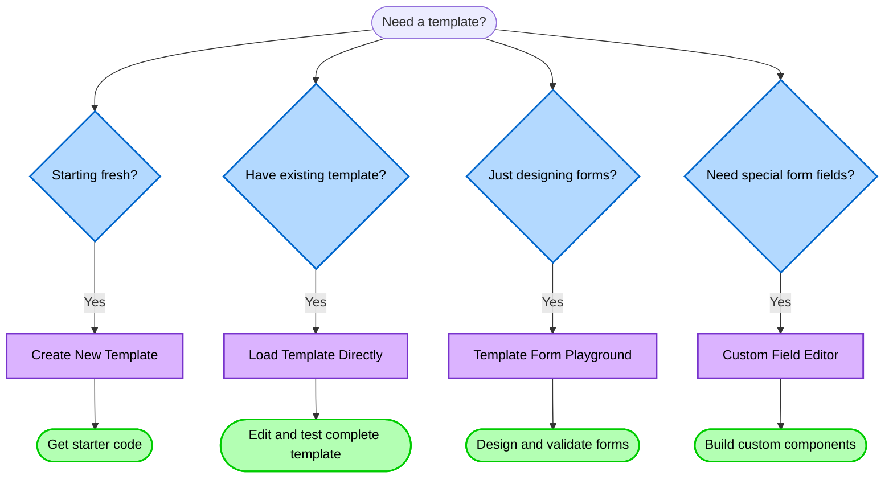

The Template Editor is a browser-based sandbox for experimenting with templates. It offers a live preview and an interactive environment to prototype ideas, understand how templates work, and test configurations before deploying them to your `software-templates` repository.

The Template Editor is designed for:

- **🚀 Rapid prototyping** - Quickly test template ideas 

- **📚 Learning** - Understand how templates work through hands-on experimentation

- **🧪 Testing** - Validate parameter forms, custom fields, and template logic

- **🔧 Debugging** - Troubleshoot issues in a controlled environment

Overall, it simplifies template development by providing everything you need in one place. Whether you're creating your first template or debugging complex configurations, the Template Editor streamlines your workflow from idea to deployment.

---

## Prerequisites

import TemplatePrerequisites from '../includes/_template-prerequisites.mdx';

<TemplatePrerequisites />

---

## Choose the best UI option

Each tool serves a specific purpose in the template development lifecycle, allowing you to focus on one aspect at a time for maximum efficiency.



<br />

| Option | Description | When to Use |
| --- | --- | --- |
| [Create New Template](./create-new-template.mdx)  | Provides a minimal blank template to start from scratch.<br /><br />**Perfect for:** <ul><li>Learning template syntax and structure</li><li>Prototyping new template ideas</li><li>Quick experiments without local setup</li><li>Understanding how template steps work</li></ul>  | Building a new template and want a quick starting point |
| [Load Template Directory](./load-template-directly.mdx)  | Upload and edit an existing template file directly within the portal.<br /><br />**Perfect for:**<ul><li>Testing templates before committing to the repository</li><li>Debugging template issues</li><li>Making quick adjustments during development</li><li>Learning from existing template examples</li></ul> | Modifying existing templates or testing complete workflows |
| [Template Form Playground](./template-form-playground.mdx)  | Design and test parameter forms in isolation. <br /><br />**Perfect for:** <ul><li>Rapidly iterating on form design</li><li>Testing complex parameter configurations</li><li>Understanding field validations and dependencies</li><li>Experimenting with multi-step forms</li></ul> | Perfecting form UX without worrying about template logic |
| [Custom Field Editor](./custom-field-editor.mdx)  | Explore, test, and understand custom form fields before using them in your templates. <br /><br />**Perfect for:** <ul><li>Discovering what custom fields are available</li><li>Understanding how custom fields behave</li><li>Testing field configurations before use</li><li>Learning field-specific options</li></ul> | Default form fields don't meet your needs |

---

## Debugging Issues

- Form problems? → **Template Form Playground**

- Action failures? → **Load Template Directly**

- Field behavior? → **Custom Field Editor**

---

## Common gotchas

1. **YAML indentation** - Be precise with spacing

2. **Parameter references** - Use `${{ parameters.fieldName }}`

3. **Step IDs** - Must be unique within a template

4. **Custom fields** - Not all may be available in your instance

5. **Saving behavior** - **Create New Template** saves to browser storage; **Load Template Directory** saves to original files

---

## Simple tutorials to try

import Tabs from '@theme/Tabs';
import TabItem from '@theme/TabItem';

<Tabs queryString="tutorials-to-try">
<TabItem value="basic-structure" label="Basic structure">

1. Select **Create New Template** in the Template Editor.

1. Create a folder for the template either locally or your local version of the `software-templates` repo. Then click **Select** to populate the minimal template files.

1. Once populated, you'll be presented with two messages to view and save the template files in the folder. Select **View files** and then **Save Changes**.

1. Paste the following yaml code in the `template.yaml` file.

    ```yaml
    apiVersion: scaffolder.backstage.io/v1beta3
    kind: Template
    metadata:
      name: learning-template
      title: My Learning Template
      description: Understanding how templates work
    spec:
      owner: user:guest
      type: service
      
      # These are the form fields users will fill out
      parameters:
        - title: Basic Information
          required:
            - name
          properties:
            name:
              title: Name
              type: string
              description: Name of the component
              
      # These are the actions the template performs
      steps:
        - id: log
          name: Log Message
          action: debug:log
          input:
            message: 'Hello ${{ parameters.name }}!'
            
      # This defines what the user sees after the template runs
      output:
        text:
          - title: 'Template Execution Complete! 🎉'
            content: |
              Your learning template has successfully executed!
    ```

3. Provide a name and click **Review > Create** to run a dry test.

1. Check the **Log** and **Output** tabs in the **Dry-run results**.

4. Modify the template and test again.

</TabItem>
<TabItem value="parameters" label="Experiment with parameters">

Use the **Template Form Playground** to rapidly test different parameter types.

**Learning Points:**

- See how different field types render

- Test validation rules

- Understand default values

- Experiment with field dependencies

```yaml
parameters:
  - title: Experiment with Fields
    properties:
      textExample:
        title: Text Field
        type: string
        default: 'Default value'
        
      numberExample:
        title: Number Field
        type: number
        minimum: 1
        maximum: 10
        
      selectExample:
        title: Dropdown
        type: string
        enum:
          - option1
          - option2
          - option3
        enumNames:
          - 'First Option'
          - 'Second Option'  
          - 'Third Option'
          
      booleanExample:
        title: Checkbox
        type: boolean
        default: false
```

</TabItem>
<TabItem value="idea" label="Test a new template idea">

You have an idea for a template but want to validate it works before investing time in a full implementation.

1. Start in **Template Form Playground**

   - Design your parameter form

   - Test the user experience

   - Validate your field choices

2. Move to **Create New Template**

   - Copy your tested parameters

   - Add template steps

   - Test with dry runs

3. Iterate Quickly

   - Make changes

   - Test immediately

   - No Git commits needed

   - No PR reviews required

#### Example: Prototyping a service template

```yaml
# Start simple in the playground
parameters:
  - title: Service Configuration
    properties:
      name:
        title: Service Name
        type: string
        pattern: '^[a-z][a-z0-9-]*$'
        
      language:
        title: Programming Language
        type: string
        enum: ['java', 'python', 'nodejs']
        
      includeDatabase:
        title: Include Database?
        type: boolean
        
      # Conditional field - only shows if includeDatabase is true
      databaseType:
        title: Database Type
        type: string
        enum: ['postgresql', 'mysql', 'mongodb']
        condition:
          properties:
            includeDatabase:
              const: true
```

</TabItem>
<TabItem value="custom-fields" label="Test Custom Fields">

Before using custom fields in production templates, test them in the **Custom Field Editor**:

1. **Discover available fields**

   - Browse the dropdown list

   - See what's installed in your instance

2. **Test configurations**

    ```yaml
    # Example: Testing OwnerPicker
    ui:field: OwnerPicker
    ui:options:
      catalogFilter:
        kind: Group
        metadata.namespace: default
    ```

3. **Validate behavior**

   - Does it show the right options?

   - Does filtering work correctly?

   - Are the selected values in the right format?

</TabItem>
</Tabs>


